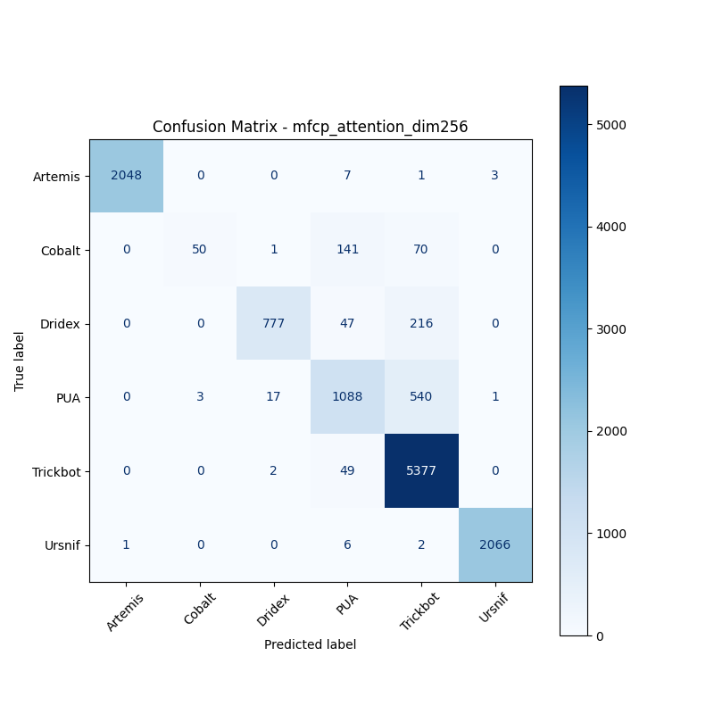
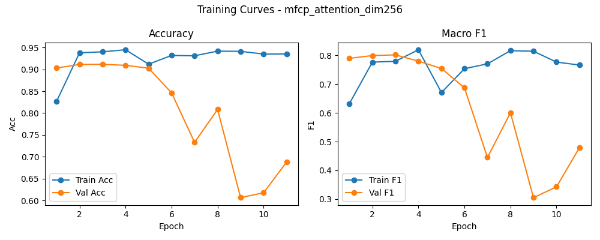

# 融合方式: attention

**Test Accuracy:** 0.9115

**Macro F1:** 0.8017

**分类报告:**

              precision    recall  f1-score   support

           0     0.9995    0.9947    0.9971      2059
           1     0.9434    0.1908    0.3175       262
           2     0.9749    0.7471    0.8459      1040
           3     0.8132    0.6598    0.7285      1649
           4     0.8664    0.9906    0.9244      5428
           5     0.9981    0.9957    0.9969      2075

    accuracy                         0.9115     12513
   macro avg     0.9326    0.7631    0.8017     12513
weighted avg     0.9138    0.9115    0.9033     12513

**混淆矩阵:**

[[2048    0    0    7    1    3]
 [   0   50    1  141   70    0]
 [   0    0  777   47  216    0]
 [   0    3   17 1088  540    1]
 [   0    0    2   49 5377    0]
 [   1    0    0    6    2 2066]]

