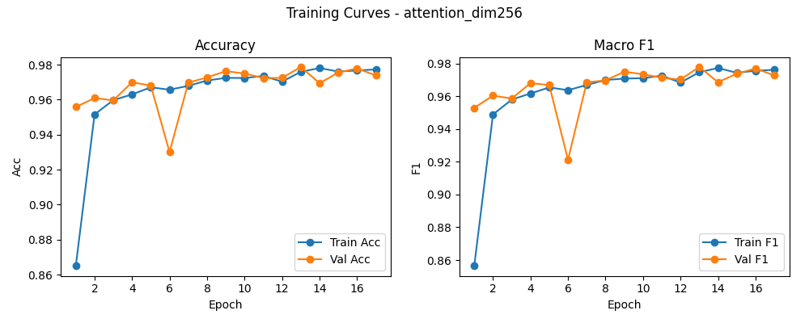

# 融合方式: attention

**Test Accuracy:** 0.9764

**Macro F1:** 0.9750

**分类报告:**

              precision    recall  f1-score   support

           0     1.0000    0.9994    0.9997      1648
           1     0.9957    0.9892    0.9924      1393
           2     0.9604    0.9876    0.9738      1130
           3     0.9856    0.9809    0.9832       209
           4     0.9566    0.8901    0.9222      1511
           5     0.9748    0.9724    0.9736      1194
           6     0.9975    0.9975    0.9975      1968
           7     0.9970    0.9994    0.9982      1657
           8     0.8815    0.9451    0.9122      1165
           9     0.9973    0.9964    0.9968      1107

    accuracy                         0.9764     12982
   macro avg     0.9746    0.9758    0.9750     12982
weighted avg     0.9769    0.9764    0.9763     12982

**混淆矩阵:**

[[1647    0    1    0    0    0    0    0    0    0]
 [   0 1378   12    2    0    0    0    0    1    0]
 [   0    5 1116    0    6    1    0    0    2    0]
 [   0    0    2  205    2    0    0    0    0    0]
 [   0    0   15    0 1345   17    0    1  133    0]
 [   0    0    7    1   11 1161    1    2   10    1]
 [   0    0    2    0    1    0 1963    0    2    0]
 [   0    0    0    0    0    0    0 1656    0    1]
 [   0    1    6    0   41   12    1    2 1101    1]
 [   0    0    1    0    0    0    3    0    0 1103]]

