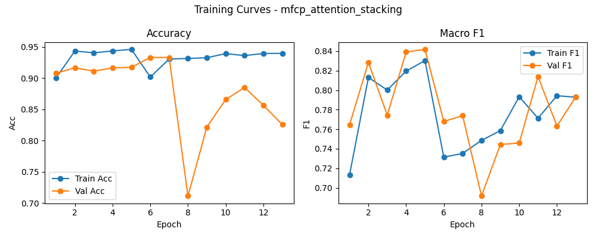

# 融合方式: attention+stacking (xgboost)

**Test Accuracy:** 0.9205

**Macro F1:** 0.8343

**分类报告:**

              precision    recall  f1-score   support

           0     0.9961    0.9981    0.9971      2059
           1     0.7083    0.4542    0.5535       262
           2     0.6089    0.8952    0.7248      1040
           3     0.8955    0.6756    0.7701      1649
           4     0.9621    0.9637    0.9629      5428
           5     0.9981    0.9966    0.9973      2075

    accuracy                         0.9205     12513
   macro avg     0.8615    0.8306    0.8343     12513
weighted avg     0.9302    0.9205    0.9205     12513

**混淆矩阵:**

[[2055    0    1    0    0    3]
 [   1  119   55   65   22    0]
 [   1    9  931   34   65    0]
 [   0   29  386 1114  119    1]
 [   1   11  155   30 5231    0]
 [   5    0    1    1    0 2068]]

