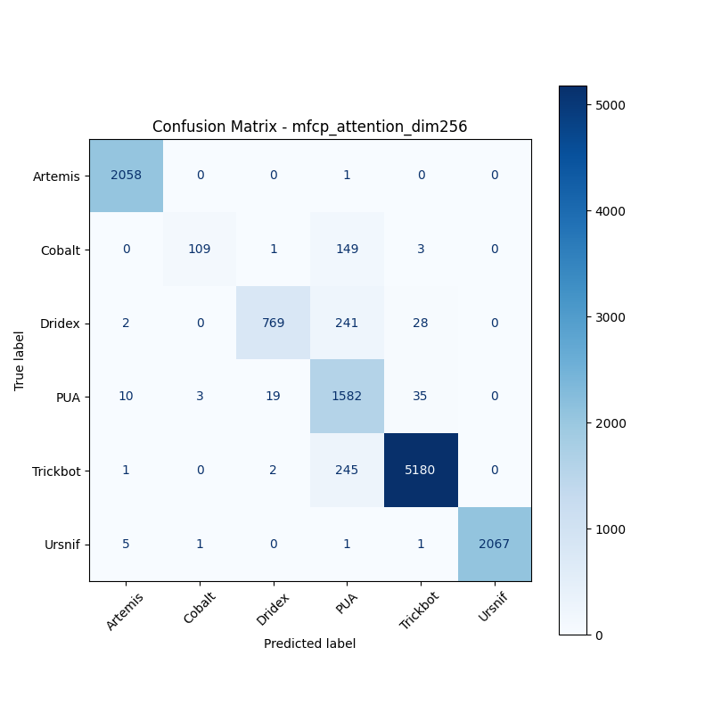

# 融合方式: attention

**Test Accuracy:** 0.9402

**Macro F1:** 0.8672

**分类报告:**

              precision    recall  f1-score   support

           0     0.9913    0.9995    0.9954      2059
           1     0.9646    0.4160    0.5813       262
           2     0.9722    0.7394    0.8400      1040
           3     0.7129    0.9594    0.8180      1649
           4     0.9872    0.9543    0.9705      5428
           5     1.0000    0.9961    0.9981      2075

    accuracy                         0.9402     12513
   macro avg     0.9380    0.8441    0.8672     12513
weighted avg     0.9522    0.9402    0.9401     12513

**混淆矩阵:**

[[2058    0    0    1    0    0]
 [   0  109    1  149    3    0]
 [   2    0  769  241   28    0]
 [  10    3   19 1582   35    0]
 [   1    0    2  245 5180    0]
 [   5    1    0    1    1 2067]]

