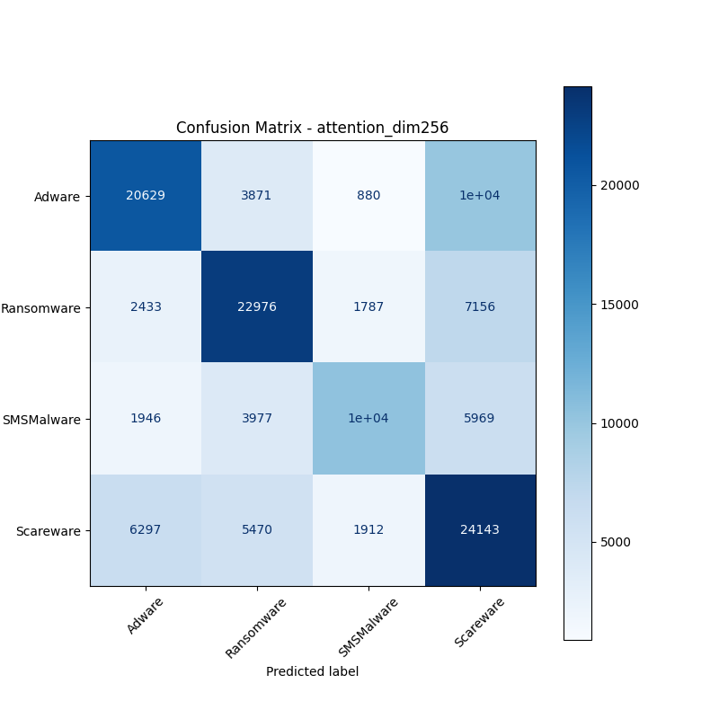
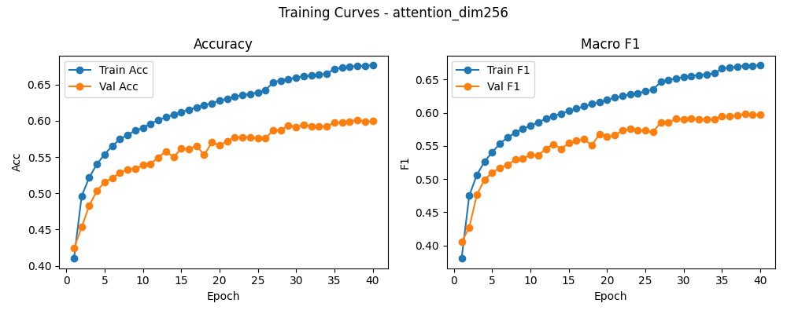

# 融合方式: attention

**Test Accuracy:** 0.6015

**Macro F1:** 0.5982

**分类报告:**

              precision    recall  f1-score   support

           0     0.6590    0.5827    0.6185     35405
           1     0.6331    0.6688    0.6505     34352
           2     0.6930    0.4650    0.5566     22230
           3     0.5105    0.6383    0.5673     37822

    accuracy                         0.6015    129809
   macro avg     0.6239    0.5887    0.5982    129809
weighted avg     0.6147    0.6015    0.6014    129809

**混淆矩阵:**

[[20629  3871   880 10025]
 [ 2433 22976  1787  7156]
 [ 1946  3977 10338  5969]
 [ 6297  5470  1912 24143]]

