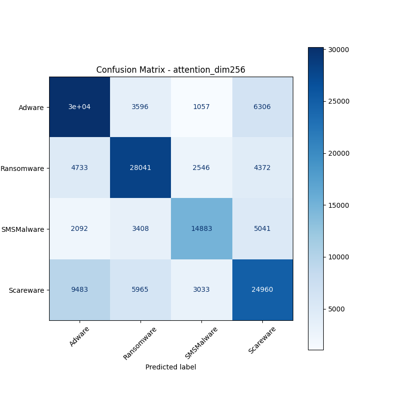
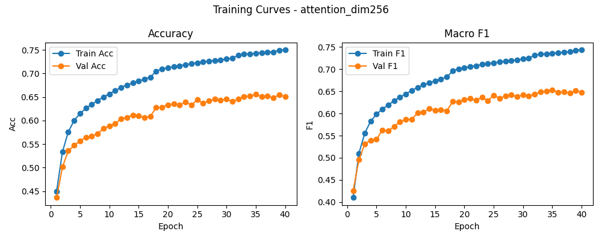

# 融合方式: attention

**Test Accuracy:** 0.6551

**Macro F1:** 0.6529

**分类报告:**

              precision    recall  f1-score   support

           0     0.6494    0.7338    0.6890     41163
           1     0.6838    0.7065    0.6949     39692
           2     0.6916    0.5854    0.6341     25424
           3     0.6136    0.5746    0.5934     43441

    accuracy                         0.6551    149720
   macro avg     0.6596    0.6500    0.6529    149720
weighted avg     0.6553    0.6551    0.6535    149720

**混淆矩阵:**

[[30204  3596  1057  6306]
 [ 4733 28041  2546  4372]
 [ 2092  3408 14883  5041]
 [ 9483  5965  3033 24960]]

