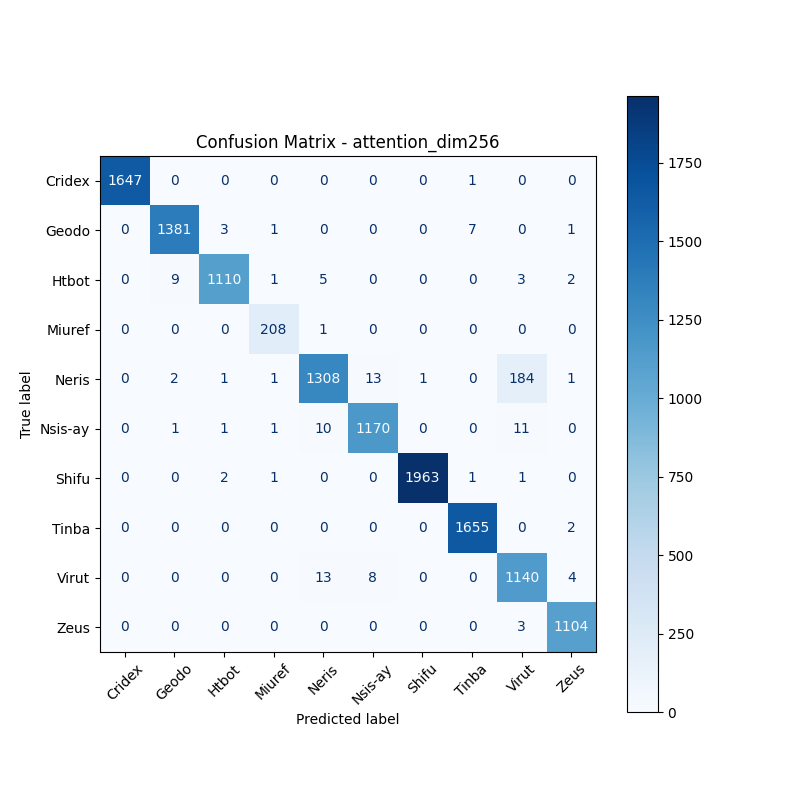
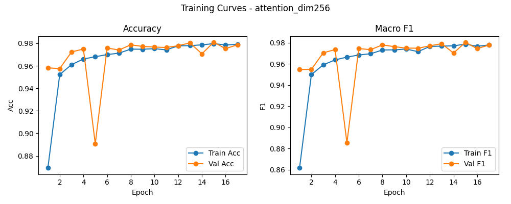

# 融合方式: attention

**Test Accuracy:** 0.9772

**Macro F1:** 0.9763

**分类报告:**

              precision    recall  f1-score   support

           0     1.0000    0.9994    0.9997      1648
           1     0.9914    0.9914    0.9914      1393
           2     0.9937    0.9823    0.9880      1130
           3     0.9765    0.9952    0.9858       209
           4     0.9783    0.8657    0.9185      1511
           5     0.9824    0.9799    0.9811      1194
           6     0.9995    0.9975    0.9985      1968
           7     0.9946    0.9988    0.9967      1657
           8     0.8495    0.9785    0.9095      1165
           9     0.9910    0.9973    0.9941      1107

    accuracy                         0.9772     12982
   macro avg     0.9757    0.9786    0.9763     12982
weighted avg     0.9790    0.9772    0.9773     12982

**混淆矩阵:**

[[1647    0    0    0    0    0    0    1    0    0]
 [   0 1381    3    1    0    0    0    7    0    1]
 [   0    9 1110    1    5    0    0    0    3    2]
 [   0    0    0  208    1    0    0    0    0    0]
 [   0    2    1    1 1308   13    1    0  184    1]
 [   0    1    1    1   10 1170    0    0   11    0]
 [   0    0    2    1    0    0 1963    1    1    0]
 [   0    0    0    0    0    0    0 1655    0    2]
 [   0    0    0    0   13    8    0    0 1140    4]
 [   0    0    0    0    0    0    0    0    3 1104]]

