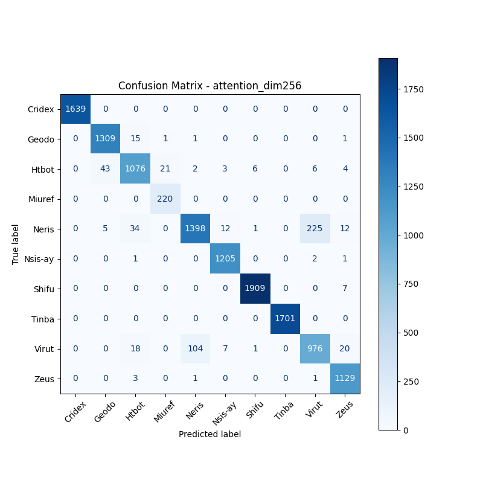
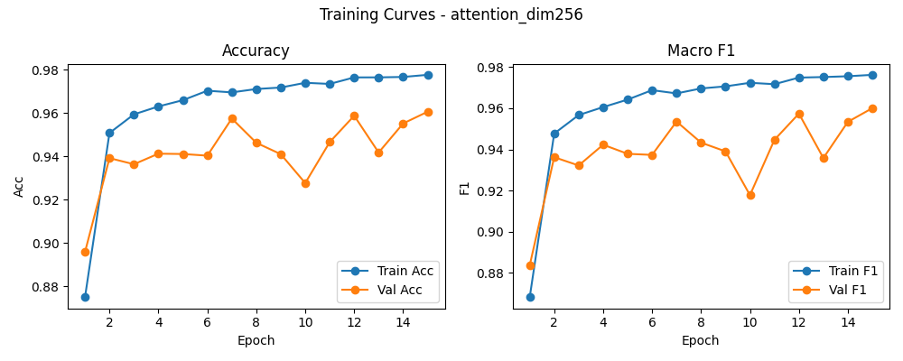

# 融合方式: attention

**Test Accuracy:** 0.9575

**Macro F1:** 0.9535

**分类报告:**

              precision    recall  f1-score   support

           0     1.0000    1.0000    1.0000      1639
           1     0.9646    0.9864    0.9754      1327
           2     0.9381    0.9268    0.9324      1161
           3     0.9091    1.0000    0.9524       220
           4     0.9283    0.8287    0.8757      1687
           5     0.9821    0.9967    0.9893      1209
           6     0.9958    0.9963    0.9961      1916
           7     1.0000    1.0000    1.0000      1701
           8     0.8066    0.8668    0.8356      1126
           9     0.9617    0.9956    0.9783      1134

    accuracy                         0.9575     13120
   macro avg     0.9486    0.9597    0.9535     13120
weighted avg     0.9580    0.9575    0.9572     13120

**混淆矩阵:**

[[1639    0    0    0    0    0    0    0    0    0]
 [   0 1309   15    1    1    0    0    0    0    1]
 [   0   43 1076   21    2    3    6    0    6    4]
 [   0    0    0  220    0    0    0    0    0    0]
 [   0    5   34    0 1398   12    1    0  225   12]
 [   0    0    1    0    0 1205    0    0    2    1]
 [   0    0    0    0    0    0 1909    0    0    7]
 [   0    0    0    0    0    0    0 1701    0    0]
 [   0    0   18    0  104    7    1    0  976   20]
 [   0    0    3    0    1    0    0    0    1 1129]]

