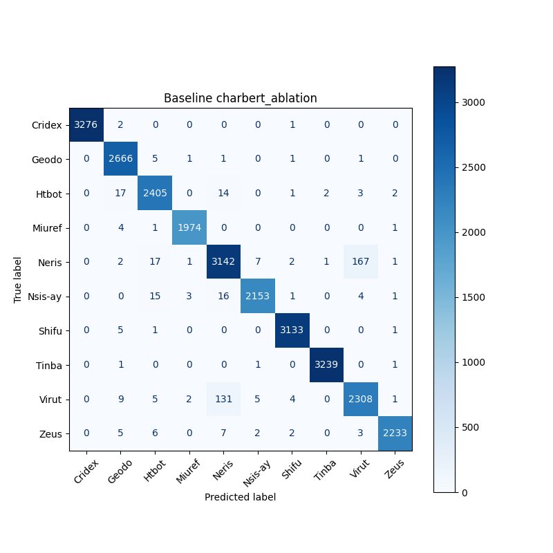
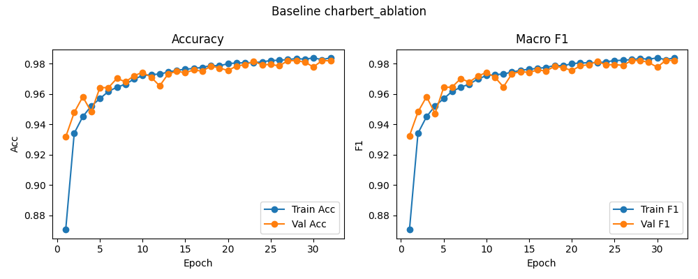

# Baseline: charbert_ablation

**Test Accuracy:** 0.9820

**Macro F1:** 0.9821

**分类报告:**

              precision    recall  f1-score   support

           0     1.0000    0.9991    0.9995      3279
           1     0.9834    0.9966    0.9900      2675
           2     0.9796    0.9840    0.9818      2444
           3     0.9965    0.9970    0.9967      1980
           4     0.9490    0.9407    0.9448      3340
           5     0.9931    0.9818    0.9874      2193
           6     0.9962    0.9978    0.9970      3140
           7     0.9991    0.9991    0.9991      3242
           8     0.9284    0.9363    0.9323      2465
           9     0.9964    0.9889    0.9927      2258

    accuracy                         0.9820     27016
   macro avg     0.9822    0.9821    0.9821     27016
weighted avg     0.9820    0.9820    0.9820     27016

**混淆矩阵:**

[[3276    2    0    0    0    0    1    0    0    0]
 [   0 2666    5    1    1    0    1    0    1    0]
 [   0   17 2405    0   14    0    1    2    3    2]
 [   0    4    1 1974    0    0    0    0    0    1]
 [   0    2   17    1 3142    7    2    1  167    1]
 [   0    0   15    3   16 2153    1    0    4    1]
 [   0    5    1    0    0    0 3133    0    0    1]
 [   0    1    0    0    0    1    0 3239    0    1]
 [   0    9    5    2  131    5    4    0 2308    1]
 [   0    5    6    0    7    2    2    0    3 2233]]

