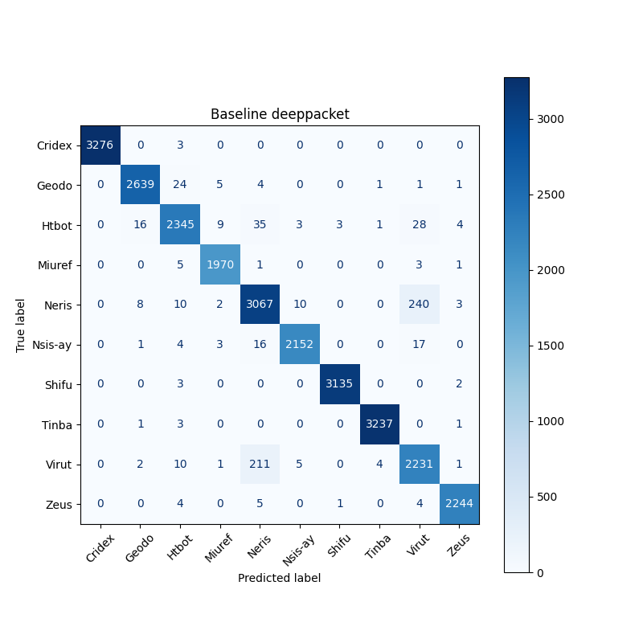
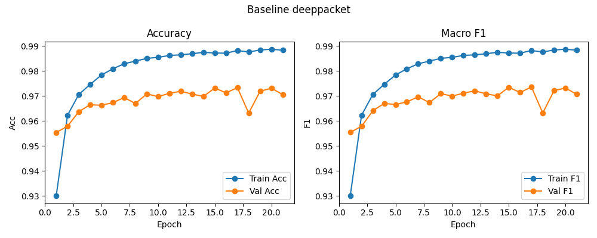

# Baseline: deeppacket

**Test Accuracy:** 0.9733

**Macro F1:** 0.9736

**分类报告:**

              precision    recall  f1-score   support

           0     1.0000    0.9991    0.9995      3279
           1     0.9895    0.9865    0.9880      2675
           2     0.9726    0.9595    0.9660      2444
           3     0.9899    0.9949    0.9924      1980
           4     0.9185    0.9183    0.9184      3340
           5     0.9917    0.9813    0.9865      2193
           6     0.9987    0.9984    0.9986      3140
           7     0.9981    0.9985    0.9983      3242
           8     0.8839    0.9051    0.8944      2465
           9     0.9942    0.9938    0.9940      2258

    accuracy                         0.9733     27016
   macro avg     0.9737    0.9735    0.9736     27016
weighted avg     0.9736    0.9733    0.9734     27016

**混淆矩阵:**

[[3276    0    3    0    0    0    0    0    0    0]
 [   0 2639   24    5    4    0    0    1    1    1]
 [   0   16 2345    9   35    3    3    1   28    4]
 [   0    0    5 1970    1    0    0    0    3    1]
 [   0    8   10    2 3067   10    0    0  240    3]
 [   0    1    4    3   16 2152    0    0   17    0]
 [   0    0    3    0    0    0 3135    0    0    2]
 [   0    1    3    0    0    0    0 3237    0    1]
 [   0    2   10    1  211    5    0    4 2231    1]
 [   0    0    4    0    5    0    1    0    4 2244]]

