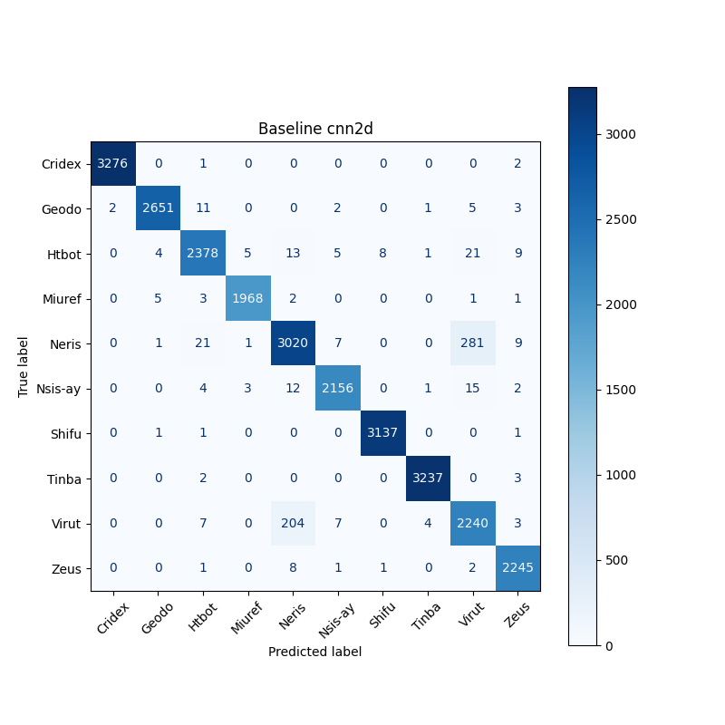
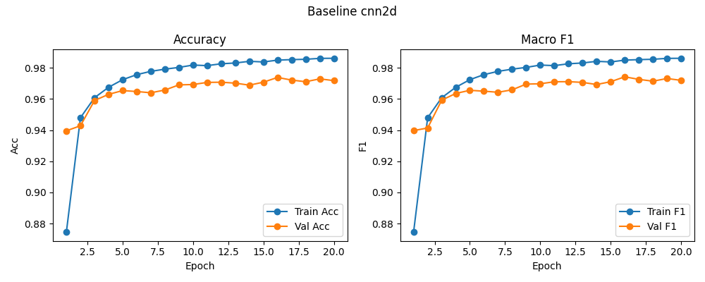

# Baseline: cnn2d

**Test Accuracy:** 0.9738

**Macro F1:** 0.9742

**分类报告:**

              precision    recall  f1-score   support

           0     0.9994    0.9991    0.9992      3279
           1     0.9959    0.9910    0.9934      2675
           2     0.9790    0.9730    0.9760      2444
           3     0.9954    0.9939    0.9947      1980
           4     0.9267    0.9042    0.9153      3340
           5     0.9899    0.9831    0.9865      2193
           6     0.9971    0.9990    0.9981      3140
           7     0.9978    0.9985    0.9981      3242
           8     0.8733    0.9087    0.8907      2465
           9     0.9855    0.9942    0.9899      2258

    accuracy                         0.9738     27016
   macro avg     0.9740    0.9745    0.9742     27016
weighted avg     0.9740    0.9738    0.9739     27016

**混淆矩阵:**

[[3276    0    1    0    0    0    0    0    0    2]
 [   2 2651   11    0    0    2    0    1    5    3]
 [   0    4 2378    5   13    5    8    1   21    9]
 [   0    5    3 1968    2    0    0    0    1    1]
 [   0    1   21    1 3020    7    0    0  281    9]
 [   0    0    4    3   12 2156    0    1   15    2]
 [   0    1    1    0    0    0 3137    0    0    1]
 [   0    0    2    0    0    0    0 3237    0    3]
 [   0    0    7    0  204    7    0    4 2240    3]
 [   0    0    1    0    8    1    1    0    2 2245]]

