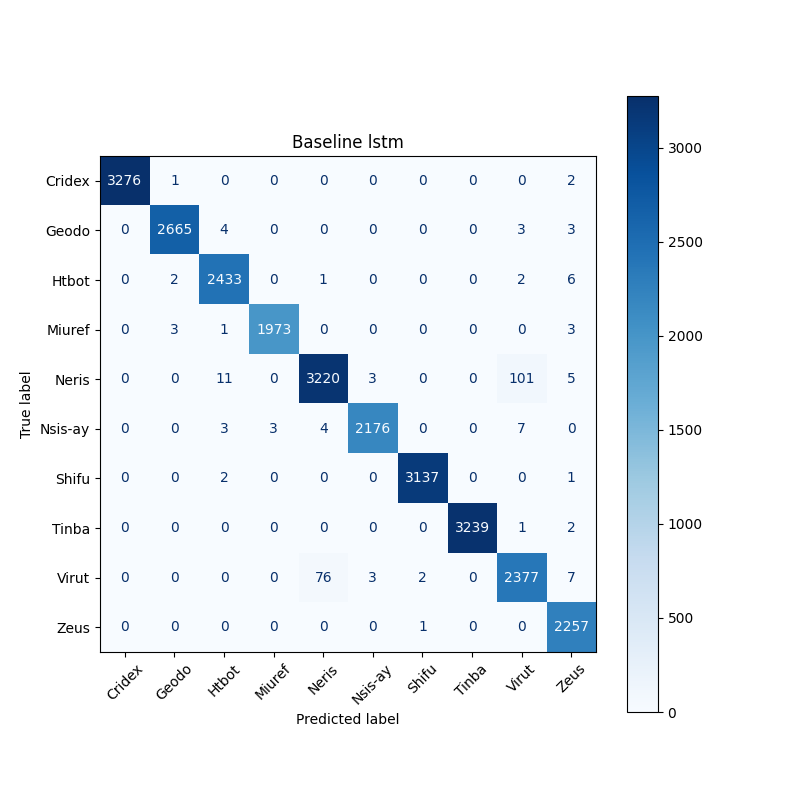
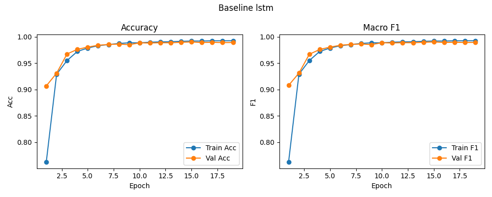

# Baseline: lstm

**Test Accuracy:** 0.9752

**Macro F1:** 0.9748

**分类报告:**

              precision    recall  f1-score   support

           0     0.9825    0.9817    0.9821      3279
           1     0.9760    0.9753    0.9756      2675
           2     0.9721    0.9703    0.9712      2444
           3     0.9805    0.9797    0.9801      1980
           4     0.9567    0.9518    0.9542      3340
           5     0.9793    0.9785    0.9789      2193
           6     0.9815    0.9807    0.9811      3140
           7     0.9827    0.9819    0.9823      3242
           8     0.9452    0.9391    0.9421      2465
           9     0.9861    0.9851    0.9856      2258

    accuracy                         0.9752     27016
   macro avg     0.9743    0.9724    0.9748     27016
weighted avg     0.9752    0.9752    0.9752     27016

**混淆矩阵:**

[[3219   15    5    0    2    0    0    0   30    8]
 [  10 2609   12    0    5    0    0    0   32    7]
 [   5   12 2371    0   15    0    0    0   35    6]
 [   0    5    8 1940    0    0    0    0   22    5]
 [   2    5   25    0 3179   15    0    0  105    9]
 [   0    0   10    8   12 2146    0    0   17    0]
 [   5    0    8    0    0    0 3079    0   45    3]
 [   0    0    5    0    0    0    0 3184   48    5]
 [  35   22   45    0  110   15    5    0 2315   18]
 [  12    7    8    0    5    0    3    0    5 2218]]

