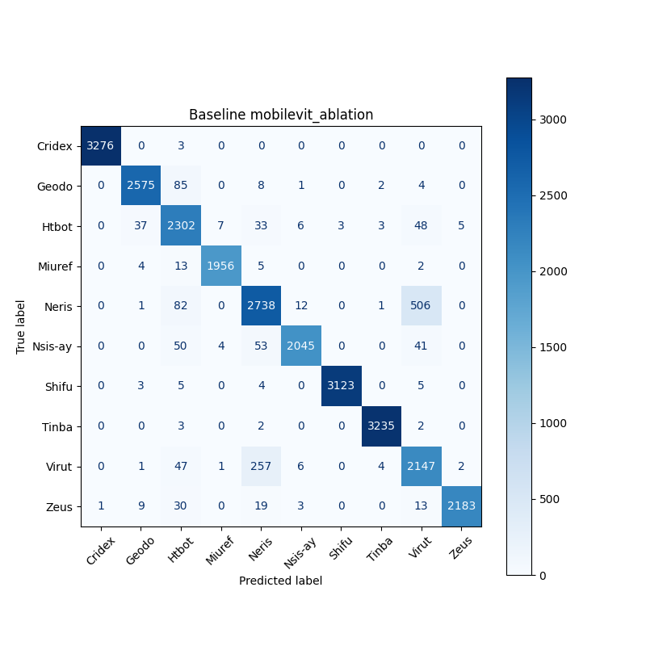
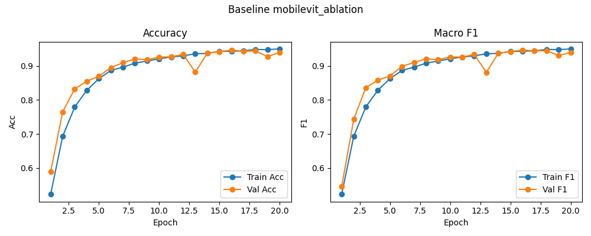

# Baseline: mobilevit_ablation

**Test Accuracy:** 0.9468

**Macro F1:** 0.9473

**分类报告:**

              precision    recall  f1-score   support

           0     0.9997    0.9991    0.9994      3279
           1     0.9791    0.9626    0.9708      2675
           2     0.8786    0.9419    0.9092      2444
           3     0.9939    0.9879    0.9909      1980
           4     0.8778    0.8198    0.8478      3340
           5     0.9865    0.9325    0.9587      2193
           6     0.9990    0.9946    0.9968      3140
           7     0.9969    0.9978    0.9974      3242
           8     0.7757    0.8710    0.8206      2465
           9     0.9968    0.9668    0.9816      2258

    accuracy                         0.9468     27016
   macro avg     0.9484    0.9474    0.9473     27016
weighted avg     0.9490    0.9468    0.9474     27016

**混淆矩阵:**

[[3276    0    3    0    0    0    0    0    0    0]
 [   0 2575   85    0    8    1    0    2    4    0]
 [   0   37 2302    7   33    6    3    3   48    5]
 [   0    4   13 1956    5    0    0    0    2    0]
 [   0    1   82    0 2738   12    0    1  506    0]
 [   0    0   50    4   53 2045    0    0   41    0]
 [   0    3    5    0    4    0 3123    0    5    0]
 [   0    0    3    0    2    0    0 3235    2    0]
 [   0    1   47    1  257    6    0    4 2147    2]
 [   1    9   30    0   19    3    0    0   13 2183]]

