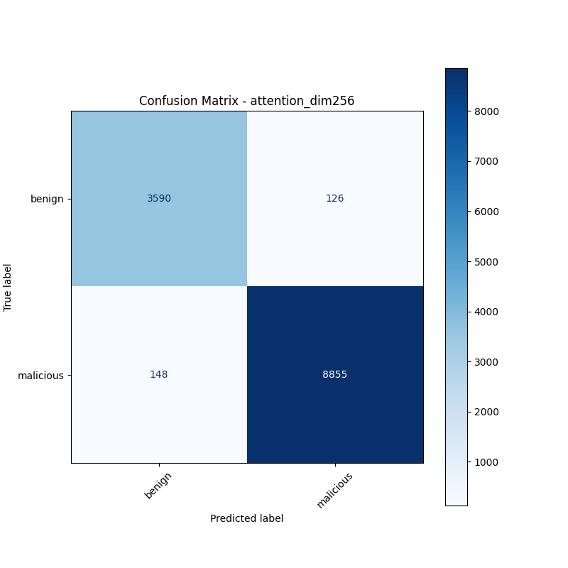
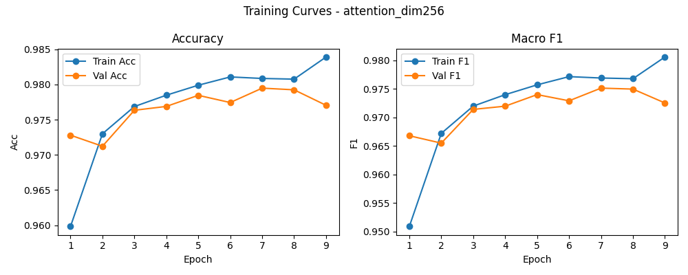

# 融合方式: attention

**Test Accuracy:** 0.9785

**Macro F1:** 0.9740

**分类报告:**

              precision    recall  f1-score   support

           0     0.9604    0.9661    0.9632      3716
           1     0.9860    0.9836    0.9848      9003

    accuracy                         0.9785     12719
   macro avg     0.9732    0.9748    0.9740     12719
weighted avg     0.9785    0.9785    0.9785     12719

**混淆矩阵:**

[[3590  126]
 [ 148 8855]]

