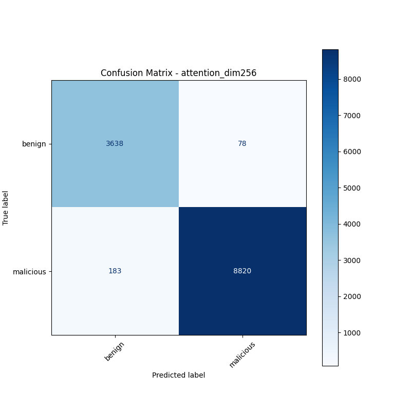
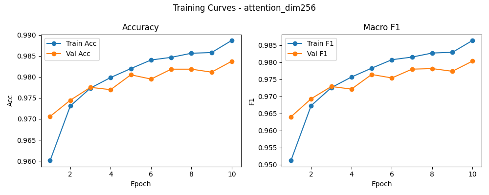

# 融合方式: attention

**Test Accuracy:** 0.9795

**Macro F1:** 0.9754

**分类报告:**

              precision    recall  f1-score   support

           0     0.9521    0.9790    0.9654      3716
           1     0.9912    0.9797    0.9854      9003

    accuracy                         0.9795     12719
   macro avg     0.9717    0.9793    0.9754     12719
weighted avg     0.9798    0.9795    0.9796     12719

**混淆矩阵:**

[[3638   78]
 [ 183 8820]]

