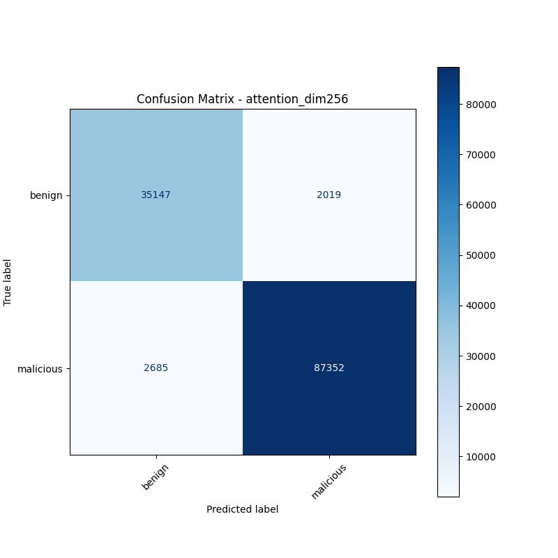
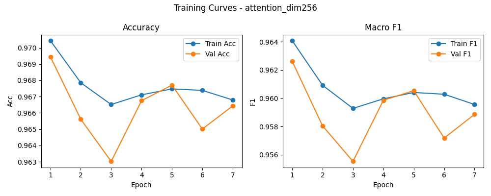

# 融合方式: attention

**Test Accuracy:** 0.9630

**Macro F1:** 0.9555

**分类报告:**

              precision    recall  f1-score   support

           0     0.9290    0.9457    0.9373     37166
           1     0.9774    0.9702    0.9738     90037

    accuracy                         0.9630    127203
   macro avg     0.9532    0.9579    0.9555    127203
weighted avg     0.9633    0.9630    0.9631    127203

**混淆矩阵:**

[[35147  2019]
 [ 2685 87352]]

