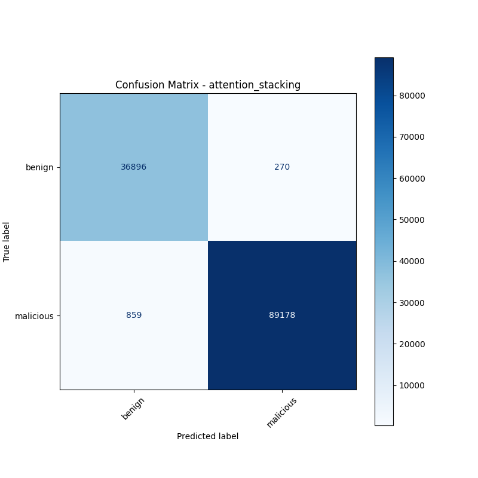
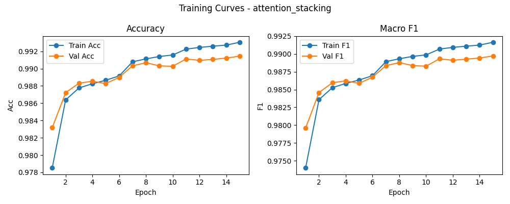

# 融合方式: attention+stacking (attention_stacking)

**Test Accuracy:** 0.9911

**Macro F1:** 0.9893

**分类报告:**

              precision    recall  f1-score   support

           0     0.9772    0.9927    0.9849     37166
           1     0.9970    0.9905    0.9937     90037

    accuracy                         0.9911    127203
   macro avg     0.9871    0.9916    0.9893    127203
weighted avg     0.9912    0.9911    0.9911    127203

**混淆矩阵:**

[[36896   270]
 [  859 89178]]

