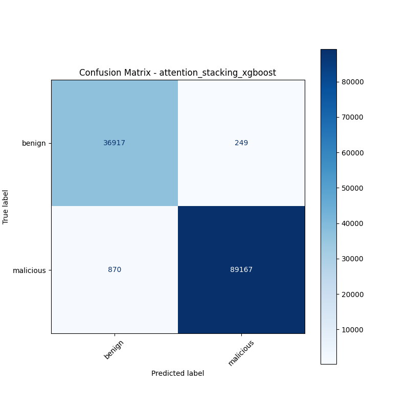

# 融合方式: attention+stacking (xgboost)

**Test Accuracy:** 0.9912

**Macro F1:** 0.9894

**分类报告:**

              precision    recall  f1-score   support

           0     0.9770    0.9933    0.9851     37166
           1     0.9972    0.9903    0.9938     90037

    accuracy                         0.9912    127203
   macro avg     0.9871    0.9918    0.9894    127203
weighted avg     0.9913    0.9912    0.9912    127203

**混淆矩阵:**

[[36917   249]
 [  870 89167]]

