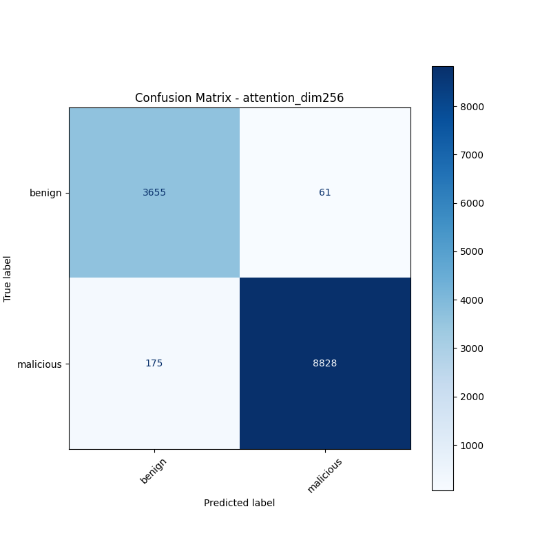
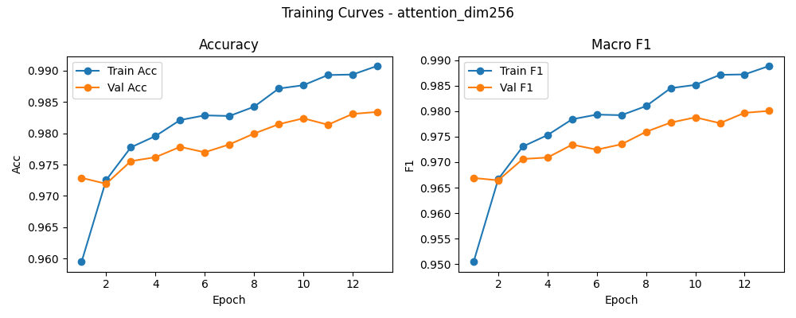

# 融合方式: attention

**Test Accuracy:** 0.9814

**Macro F1:** 0.9778

**分类报告:**

              precision    recall  f1-score   support

           0     0.9543    0.9836    0.9687      3716
           1     0.9931    0.9806    0.9868      9003

    accuracy                         0.9814     12719
   macro avg     0.9737    0.9821    0.9778     12719
weighted avg     0.9818    0.9814    0.9815     12719

**混淆矩阵:**

[[3655   61]
 [ 175 8828]]

