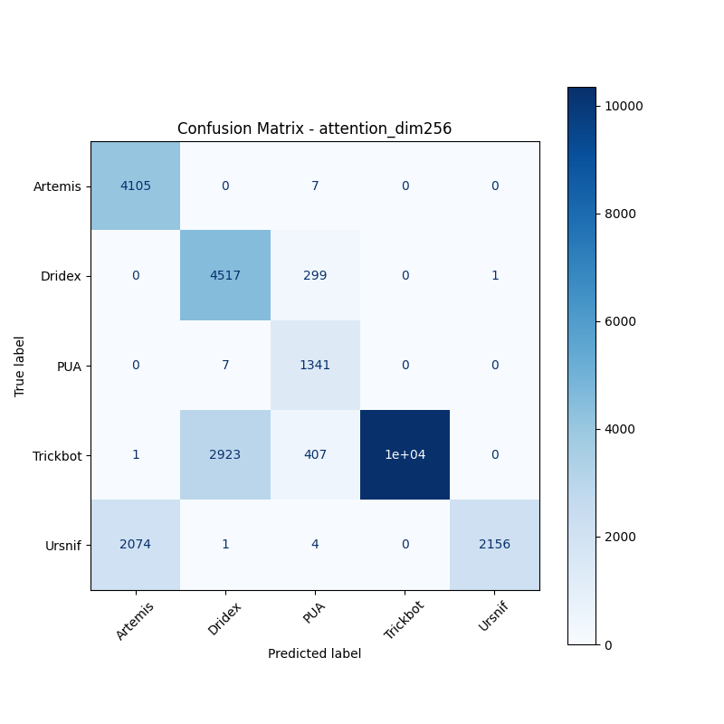
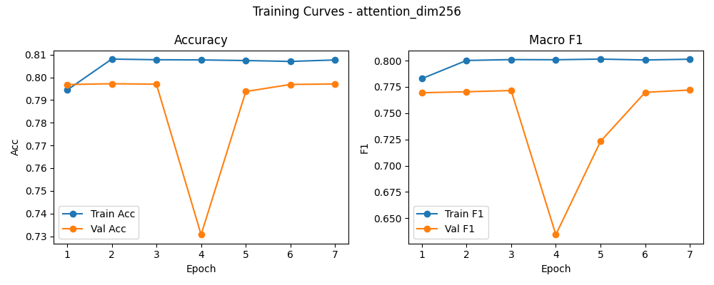

# 融合方式: attention

**Test Accuracy:** 0.7970

**Macro F1:** 0.7715

**分类报告:**

              precision    recall  f1-score   support

           0     0.6642    0.9983    0.7977      4112
           1     0.6065    0.9377    0.7366      4817
           2     0.6516    0.9948    0.7874      1348
           3     1.0000    0.7565    0.8614     13680
           4     0.9995    0.5091    0.6746      4235

    accuracy                         0.7970     28192
   macro avg     0.7844    0.8393    0.7715     28192
weighted avg     0.8671    0.7970    0.7992     28192

**混淆矩阵:**

[[ 4105     0     7     0     0]
 [    0  4517   299     0     1]
 [    0     7  1341     0     0]
 [    1  2923   407 10349     0]
 [ 2074     1     4     0  2156]]

