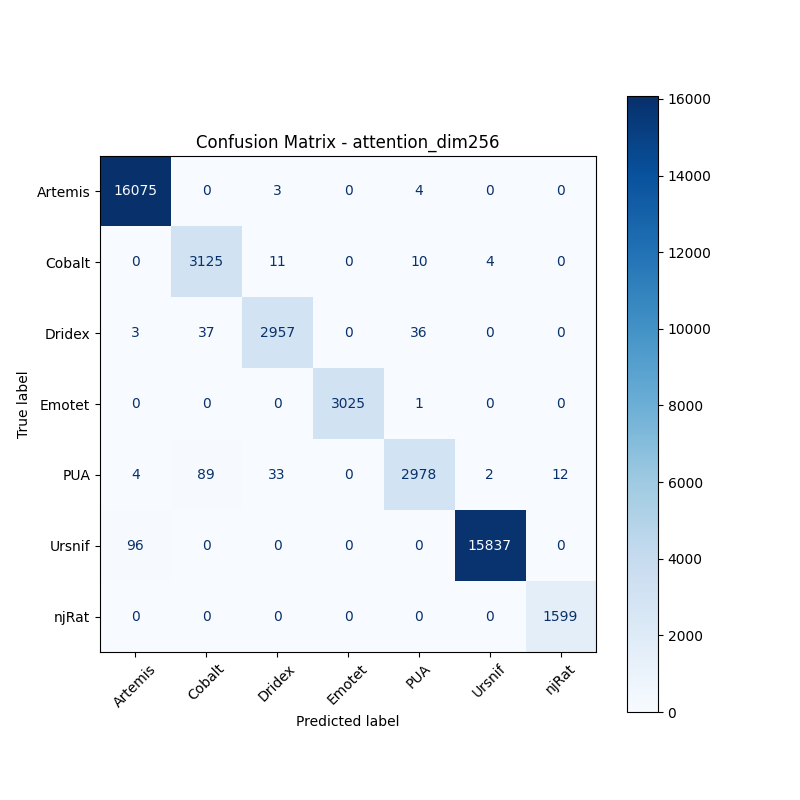
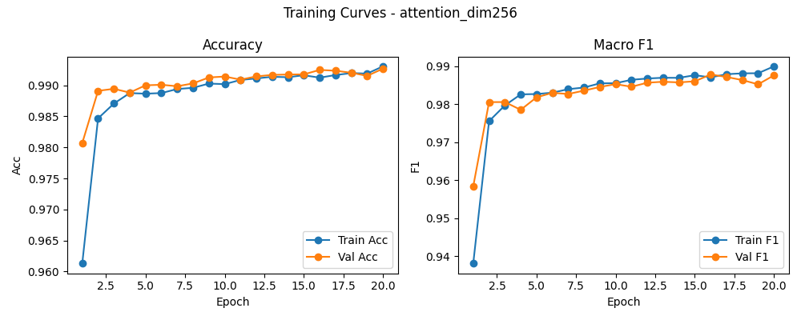

# 融合方式: attention

**Test Accuracy:** 0.9925

**Macro F1:** 0.9878

**分类报告:**

              precision    recall  f1-score   support

           0     0.9936    0.9996    0.9966     16082
           1     0.9612    0.9921    0.9764      3150
           2     0.9844    0.9749    0.9796      3033
           3     1.0000    0.9997    0.9998      3026
           4     0.9832    0.9551    0.9689      3118
           5     0.9996    0.9940    0.9968     15933
           6     0.9926    1.0000    0.9963      1599

    accuracy                         0.9925     45941
   macro avg     0.9878    0.9879    0.9878     45941
weighted avg     0.9925    0.9925    0.9925     45941

**混淆矩阵:**

[[16075     0     3     0     4     0     0]
 [    0  3125    11     0    10     4     0]
 [    3    37  2957     0    36     0     0]
 [    0     0     0  3025     1     0     0]
 [    4    89    33     0  2978     2    12]
 [   96     0     0     0     0 15837     0]
 [    0     0     0     0     0     0  1599]]

