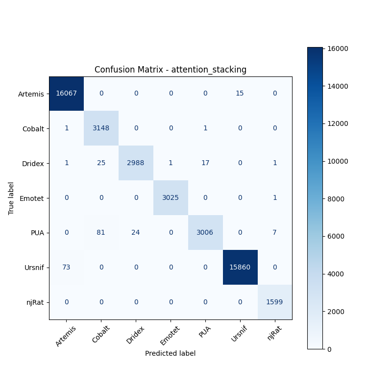

# 融合方式: attention+stacking (attention_stacking)

**Test Accuracy:** 0.9946

**Macro F1:** 0.9917

**分类报告:**

              precision    recall  f1-score   support

           0     0.9954    0.9991    0.9972     16082
           1     0.9674    0.9994    0.9831      3150
           2     0.9920    0.9852    0.9886      3033
           3     0.9997    0.9997    0.9997      3026
           4     0.9940    0.9641    0.9788      3118
           5     0.9991    0.9954    0.9972     15933
           6     0.9944    1.0000    0.9972      1599

    accuracy                         0.9946     45941
   macro avg     0.9917    0.9918    0.9917     45941
weighted avg     0.9947    0.9946    0.9946     45941

**混淆矩阵:**

[[16067     0     0     0     0    15     0]
 [    1  3148     0     0     1     0     0]
 [    1    25  2988     1    17     0     1]
 [    0     0     0  3025     0     0     1]
 [    0    81    24     0  3006     0     7]
 [   73     0     0     0     0 15860     0]
 [    0     0     0     0     0     0  1599]]

