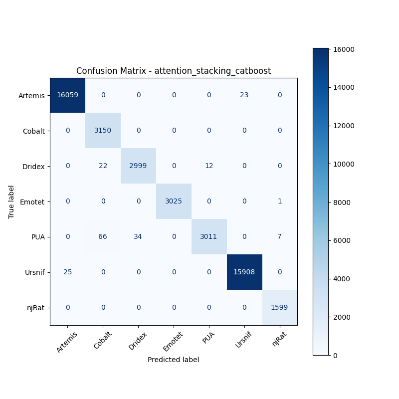
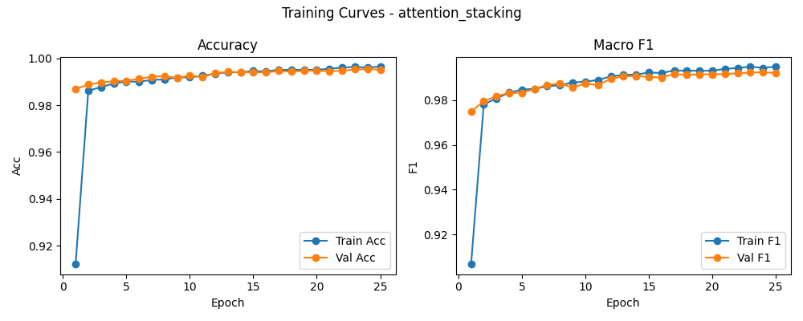

# 融合方式: attention+stacking (catboost)

**Test Accuracy:** 0.9959

**Macro F1:** 0.9929

**分类报告:**

              precision    recall  f1-score   support

           0     0.9984    0.9986    0.9985     16082
           1     0.9728    1.0000    0.9862      3150
           2     0.9888    0.9888    0.9888      3033
           3     1.0000    0.9997    0.9998      3026
           4     0.9960    0.9657    0.9806      3118
           5     0.9986    0.9984    0.9985     15933
           6     0.9950    1.0000    0.9975      1599

    accuracy                         0.9959     45941
   macro avg     0.9928    0.9930    0.9929     45941
weighted avg     0.9959    0.9959    0.9959     45941

**混淆矩阵:**

[[16059     0     0     0     0    23     0]
 [    0  3150     0     0     0     0     0]
 [    0    22  2999     0    12     0     0]
 [    0     0     0  3025     0     0     1]
 [    0    66    34     0  3011     0     7]
 [   25     0     0     0     0 15908     0]
 [    0     0     0     0     0     0  1599]]

