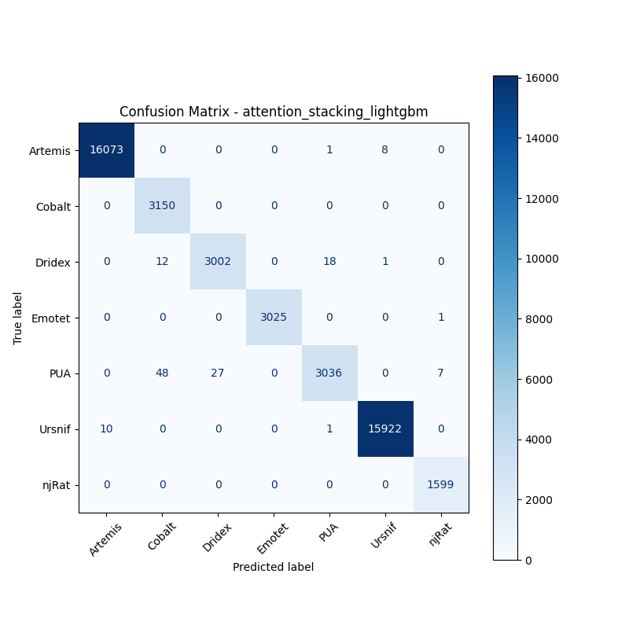

# 融合方式: attention+stacking (lightgbm)

**Test Accuracy:** 0.9971

**Macro F1:** 0.9944

**分类报告:**

              precision    recall  f1-score   support

           0     0.9994    0.9994    0.9994     16082
           1     0.9813    1.0000    0.9906      3150
           2     0.9911    0.9898    0.9904      3033
           3     1.0000    0.9997    0.9998      3026
           4     0.9935    0.9737    0.9835      3118
           5     0.9994    0.9993    0.9994     15933
           6     0.9950    1.0000    0.9975      1599

    accuracy                         0.9971     45941
   macro avg     0.9942    0.9946    0.9944     45941
weighted avg     0.9971    0.9971    0.9971     45941

**混淆矩阵:**

[[16073     0     0     0     1     8     0]
 [    0  3150     0     0     0     0     0]
 [    0    12  3002     0    18     1     0]
 [    0     0     0  3025     0     0     1]
 [    0    48    27     0  3036     0     7]
 [   10     0     0     0     1 15922     0]
 [    0     0     0     0     0     0  1599]]

