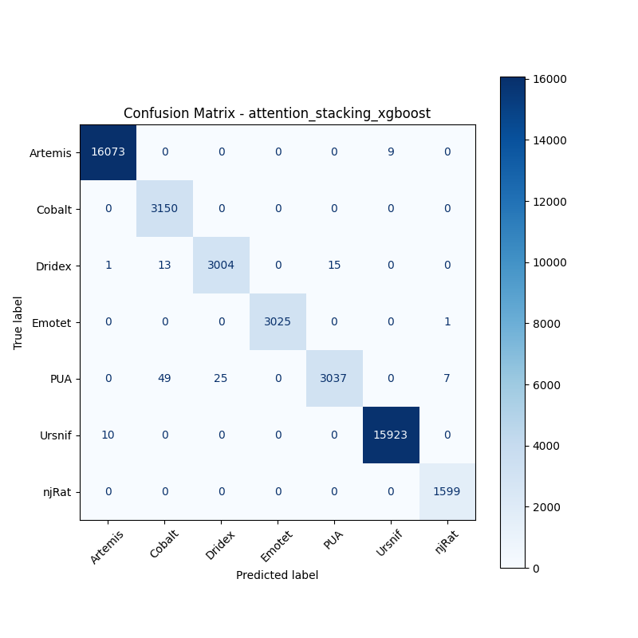

# 融合方式: attention+stacking (xgboost)

**Test Accuracy:** 0.9972

**Macro F1:** 0.9946

**分类报告:**

              precision    recall  f1-score   support

           0     0.9993    0.9994    0.9994     16082
           1     0.9807    1.0000    0.9903      3150
           2     0.9917    0.9904    0.9911      3033
           3     1.0000    0.9997    0.9998      3026
           4     0.9951    0.9740    0.9844      3118
           5     0.9994    0.9994    0.9994     15933
           6     0.9950    1.0000    0.9975      1599

    accuracy                         0.9972     45941
   macro avg     0.9945    0.9947    0.9946     45941
weighted avg     0.9972    0.9972    0.9972     45941

**混淆矩阵:**

[[16073     0     0     0     0     9     0]
 [    0  3150     0     0     0     0     0]
 [    1    13  3004     0    15     0     0]
 [    0     0     0  3025     0     0     1]
 [    0    49    25     0  3037     0     7]
 [   10     0     0     0     0 15923     0]
 [    0     0     0     0     0     0  1599]]

