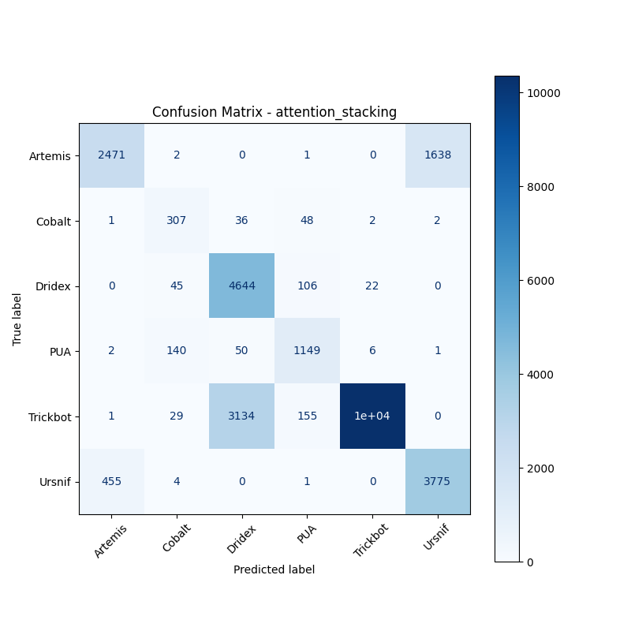

# 融合方式: attention+stacking (attention_stacking)

**Test Accuracy:** 0.7943

**Macro F1:** 0.7602

**分类报告:**

              precision    recall  f1-score   support

           0     0.8433    0.6009    0.7018      4112
           1     0.5825    0.7753    0.6652       396
           2     0.5905    0.9641    0.7324      4817
           3     0.7870    0.8524    0.8184      1348
           4     0.9971    0.7574    0.8609     13680
           5     0.6970    0.8914    0.7823      4235

    accuracy                         0.7943     28588
   macro avg     0.7496    0.8069    0.7602     28588
weighted avg     0.8464    0.7943    0.8000     28588

**混淆矩阵:**

[[ 2471     2     0     1     0  1638]
 [    1   307    36    48     2     2]
 [    0    45  4644   106    22     0]
 [    2   140    50  1149     6     1]
 [    1    29  3134   155 10361     0]
 [  455     4     0     1     0  3775]]

