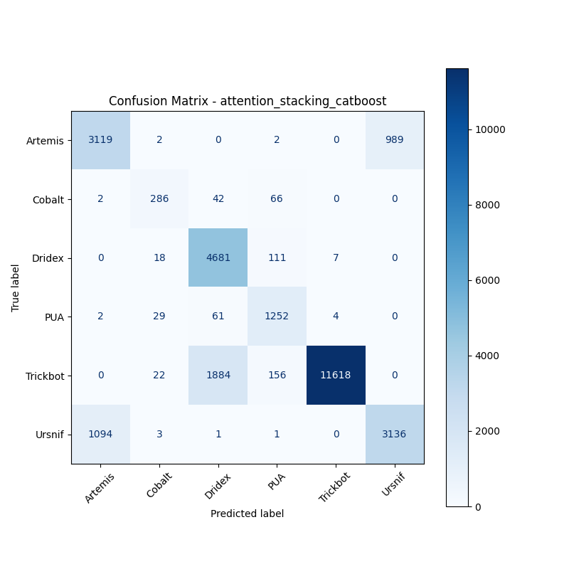

# 融合方式: attention+stacking (catboost)

**Test Accuracy:** 0.8427

**Macro F1:** 0.8070

**分类报告:**

              precision    recall  f1-score   support

           0     0.7396    0.7585    0.7489      4112
           1     0.7944    0.7222    0.7566       396
           2     0.7019    0.9718    0.8151      4817
           3     0.7884    0.9288    0.8529      1348
           4     0.9991    0.8493    0.9181     13680
           5     0.7602    0.7405    0.7502      4235

    accuracy                         0.8427     28588
   macro avg     0.7973    0.8285    0.8070     28588
weighted avg     0.8635    0.8427    0.8462     28588

**混淆矩阵:**

[[ 3119     2     0     2     0   989]
 [    2   286    42    66     0     0]
 [    0    18  4681   111     7     0]
 [    2    29    61  1252     4     0]
 [    0    22  1884   156 11618     0]
 [ 1094     3     1     1     0  3136]]

