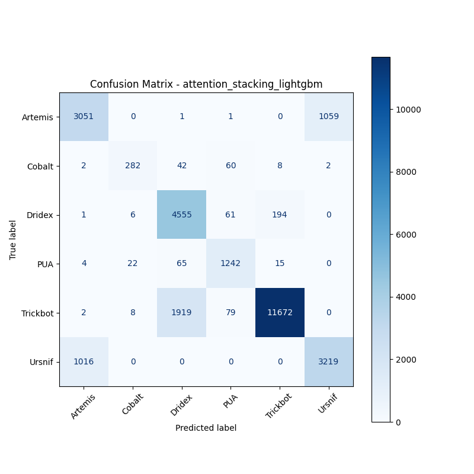

# 融合方式: attention+stacking (lightgbm)

**Test Accuracy:** 0.8402

**Macro F1:** 0.8156

**分类报告:**

              precision    recall  f1-score   support

           0     0.7485    0.7420    0.7452      4112
           1     0.8868    0.7121    0.7899       396
           2     0.6920    0.9456    0.7992      4817
           3     0.8607    0.9214    0.8900      1348
           4     0.9817    0.8532    0.9130     13680
           5     0.7521    0.7601    0.7561      4235

    accuracy                         0.8402     28588
   macro avg     0.8203    0.8224    0.8156     28588
weighted avg     0.8583    0.8402    0.8436     28588

**混淆矩阵:**

[[ 3051     0     1     1     0  1059]
 [    2   282    42    60     8     2]
 [    1     6  4555    61   194     0]
 [    4    22    65  1242    15     0]
 [    2     8  1919    79 11672     0]
 [ 1016     0     0     0     0  3219]]

