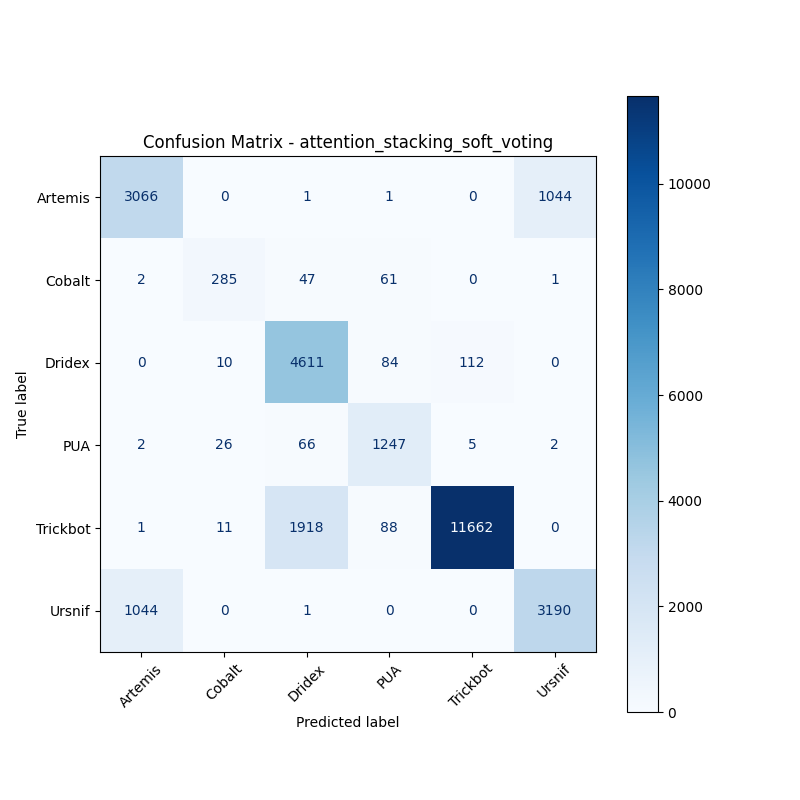
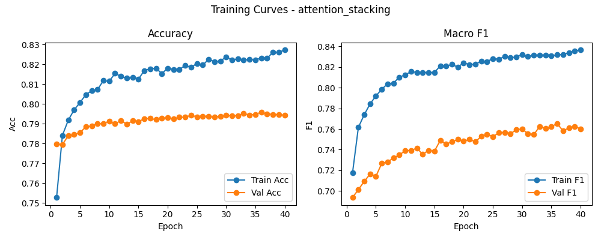

# 融合方式: attention+stacking (soft_voting)

**Test Accuracy:** 0.8416

**Macro F1:** 0.8140

**分类报告:**

              precision    recall  f1-score   support

           0     0.7451    0.7456    0.7454      4112
           1     0.8584    0.7197    0.7830       396
           2     0.6940    0.9572    0.8046      4817
           3     0.8420    0.9251    0.8816      1348
           4     0.9901    0.8525    0.9161     13680
           5     0.7529    0.7532    0.7531      4235

    accuracy                         0.8416     28588
   macro avg     0.8137    0.8256    0.8140     28588
weighted avg     0.8610    0.8416    0.8452     28588

**混淆矩阵:**

[[ 3066     0     1     1     0  1044]
 [    2   285    47    61     0     1]
 [    0    10  4611    84   112     0]
 [    2    26    66  1247     5     2]
 [    1    11  1918    88 11662     0]
 [ 1044     0     1     0     0  3190]]

