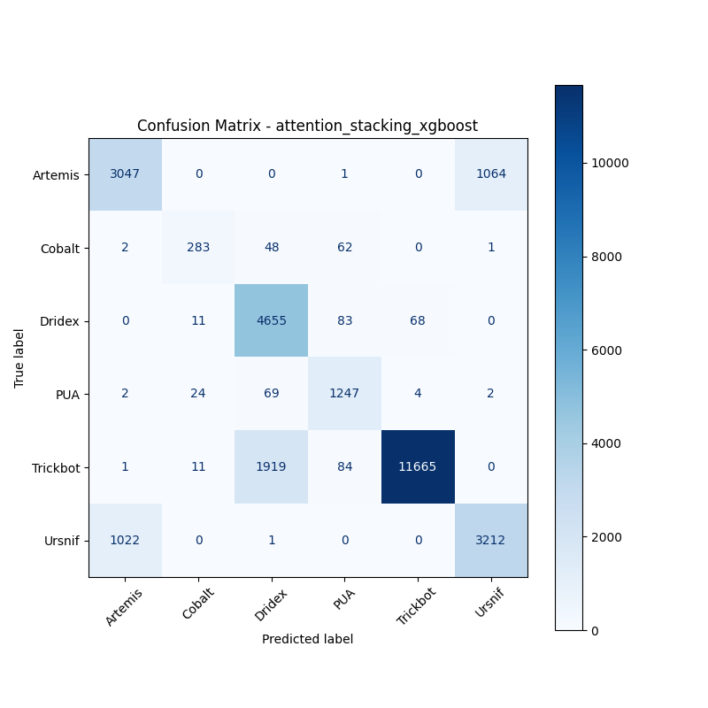

# 融合方式: attention+stacking (xgboost)

**Test Accuracy:** 0.8433

**Macro F1:** 0.8149

**分类报告:**

              precision    recall  f1-score   support

           0     0.7479    0.7410    0.7444      4112
           1     0.8602    0.7146    0.7807       396
           2     0.6956    0.9664    0.8089      4817
           3     0.8443    0.9251    0.8828      1348
           4     0.9939    0.8527    0.9179     13680
           5     0.7506    0.7584    0.7545      4235

    accuracy                         0.8433     28588
   macro avg     0.8154    0.8264    0.8149     28588
weighted avg     0.8633    0.8433    0.8468     28588

**混淆矩阵:**

[[ 3047     0     0     1     0  1064]
 [    2   283    48    62     0     1]
 [    0    11  4655    83    68     0]
 [    2    24    69  1247     4     2]
 [    1    11  1919    84 11665     0]
 [ 1022     0     1     0     0  3212]]

