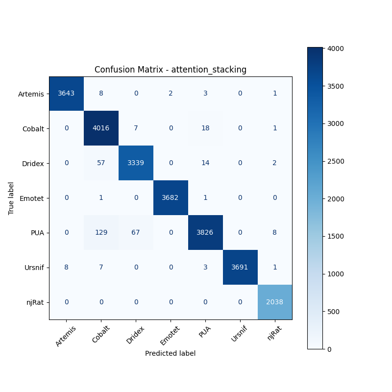

# 融合方式: attention+stacking (attention_stacking)

**Test Accuracy:** 0.9862

**Macro F1:** 0.9873

**分类报告:**

              precision    recall  f1-score   support

           0     0.9978    0.9962    0.9970      3657
           1     0.9521    0.9936    0.9724      4042
           2     0.9783    0.9786    0.9785      3412
           3     0.9995    0.9995    0.9995      3684
           4     0.9899    0.9494    0.9692      4030
           5     1.0000    0.9949    0.9974      3710
           6     0.9937    1.0000    0.9968      2038

    accuracy                         0.9862     24573
   macro avg     0.9873    0.9874    0.9873     24573
weighted avg     0.9865    0.9862    0.9862     24573

**混淆矩阵:**

[[3643    8    0    2    3    0    1]
 [   0 4016    7    0   18    0    1]
 [   0   57 3339    0   14    0    2]
 [   0    1    0 3682    1    0    0]
 [   0  129   67    0 3826    0    8]
 [   8    7    0    0    3 3691    1]
 [   0    0    0    0    0    0 2038]]

