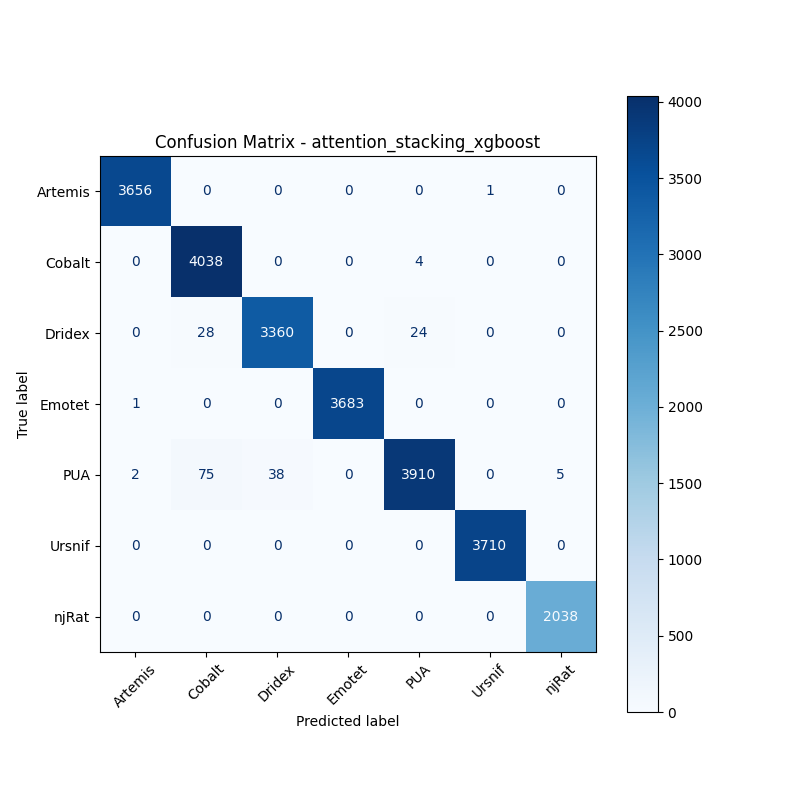
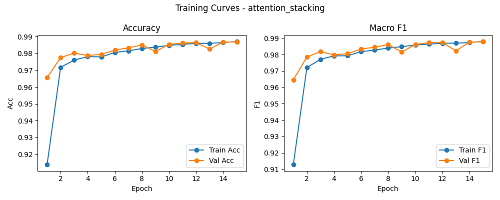

# 融合方式: attention+stacking (xgboost)

**Test Accuracy:** 0.9928

**Macro F1:** 0.9933

**分类报告:**

              precision    recall  f1-score   support

           0     0.9992    0.9997    0.9995      3657
           1     0.9751    0.9990    0.9869      4042
           2     0.9888    0.9848    0.9868      3412
           3     1.0000    0.9997    0.9999      3684
           4     0.9929    0.9702    0.9814      4030
           5     0.9997    1.0000    0.9999      3710
           6     0.9976    1.0000    0.9988      2038

    accuracy                         0.9928     24573
   macro avg     0.9933    0.9933    0.9933     24573
weighted avg     0.9928    0.9928    0.9927     24573

**混淆矩阵:**

[[3656    0    0    0    0    1    0]
 [   0 4038    0    0    4    0    0]
 [   0   28 3360    0   24    0    0]
 [   1    0    0 3683    0    0    0]
 [   2   75   38    0 3910    0    5]
 [   0    0    0    0    0 3710    0]
 [   0    0    0    0    0    0 2038]]

