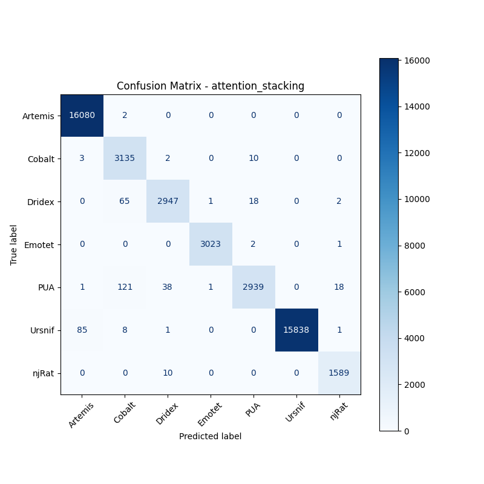

# 融合方式: attention+stacking (attention_stacking)

**Test Accuracy:** 0.9915

**Macro F1:** 0.9848

**分类报告:**

              precision    recall  f1-score   support

           0     0.9945    0.9999    0.9972     16082
           1     0.9412    0.9952    0.9674      3150
           2     0.9830    0.9716    0.9773      3033
           3     0.9993    0.9990    0.9992      3026
           4     0.9899    0.9426    0.9657      3118
           5     1.0000    0.9940    0.9970     15933
           6     0.9863    0.9937    0.9900      1599

    accuracy                         0.9915     45941
   macro avg     0.9849    0.9852    0.9848     45941
weighted avg     0.9917    0.9915    0.9915     45941

**混淆矩阵:**

[[16080     2     0     0     0     0     0]
 [    3  3135     2     0    10     0     0]
 [    0    65  2947     1    18     0     2]
 [    0     0     0  3023     2     0     1]
 [    1   121    38     1  2939     0    18]
 [   85     8     1     0     0 15838     1]
 [    0     0    10     0     0     0  1589]]

