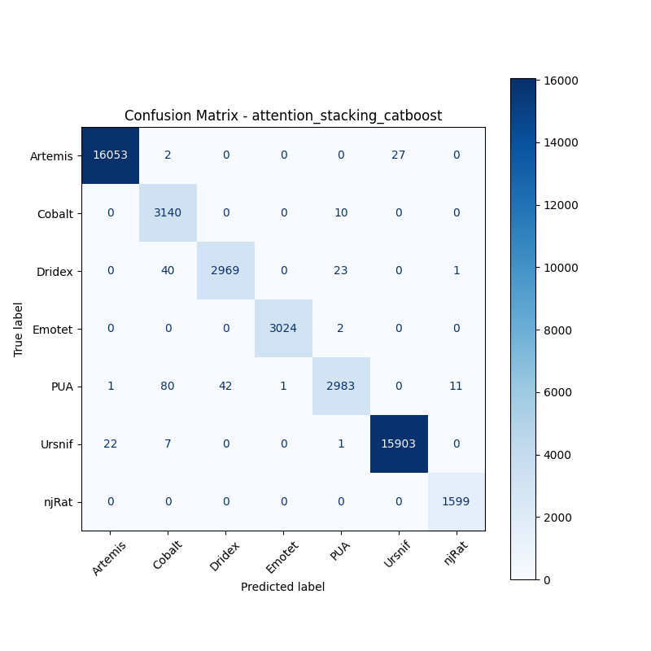

# 融合方式: attention+stacking (catboost)

**Test Accuracy:** 0.9941

**Macro F1:** 0.9893

**分类报告:**

              precision    recall  f1-score   support

           0     0.9986    0.9982    0.9984     16082
           1     0.9605    0.9968    0.9783      3150
           2     0.9861    0.9789    0.9825      3033
           3     0.9997    0.9993    0.9995      3026
           4     0.9881    0.9567    0.9721      3118
           5     0.9983    0.9981    0.9982     15933
           6     0.9926    1.0000    0.9963      1599

    accuracy                         0.9941     45941
   macro avg     0.9891    0.9897    0.9893     45941
weighted avg     0.9942    0.9941    0.9941     45941

**混淆矩阵:**

[[16053     2     0     0     0    27     0]
 [    0  3140     0     0    10     0     0]
 [    0    40  2969     0    23     0     1]
 [    0     0     0  3024     2     0     0]
 [    1    80    42     1  2983     0    11]
 [   22     7     0     0     1 15903     0]
 [    0     0     0     0     0     0  1599]]

