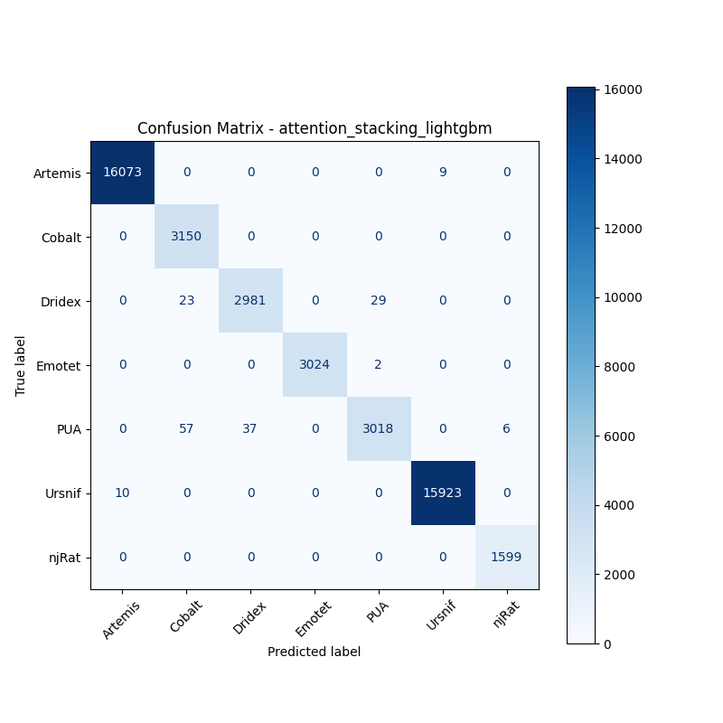

# 融合方式: attention+stacking (lightgbm)

**Test Accuracy:** 0.9962

**Macro F1:** 0.9926

**分类报告:**

              precision    recall  f1-score   support

           0     0.9994    0.9994    0.9994     16082
           1     0.9752    1.0000    0.9875      3150
           2     0.9877    0.9829    0.9853      3033
           3     1.0000    0.9993    0.9997      3026
           4     0.9898    0.9679    0.9788      3118
           5     0.9994    0.9994    0.9994     15933
           6     0.9963    1.0000    0.9981      1599

    accuracy                         0.9962     45941
   macro avg     0.9926    0.9927    0.9926     45941
weighted avg     0.9963    0.9962    0.9962     45941

**混淆矩阵:**

[[16073     0     0     0     0     9     0]
 [    0  3150     0     0     0     0     0]
 [    0    23  2981     0    29     0     0]
 [    0     0     0  3024     2     0     0]
 [    0    57    37     0  3018     0     6]
 [   10     0     0     0     0 15923     0]
 [    0     0     0     0     0     0  1599]]

