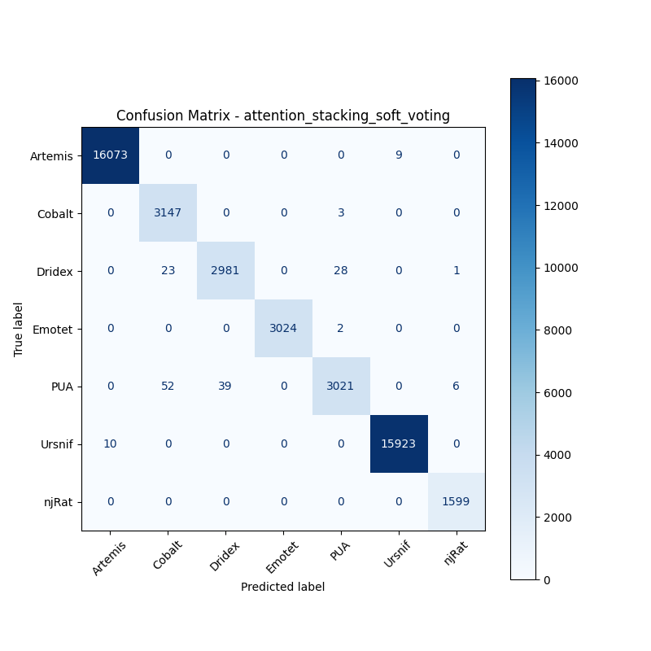

# 融合方式: attention+stacking (soft_voting)

**Test Accuracy:** 0.9962

**Macro F1:** 0.9926

**分类报告:**

              precision    recall  f1-score   support

           0     0.9994    0.9994    0.9994     16082
           1     0.9767    0.9990    0.9878      3150
           2     0.9871    0.9829    0.9850      3033
           3     1.0000    0.9993    0.9997      3026
           4     0.9892    0.9689    0.9789      3118
           5     0.9994    0.9994    0.9994     15933
           6     0.9956    1.0000    0.9978      1599

    accuracy                         0.9962     45941
   macro avg     0.9925    0.9927    0.9926     45941
weighted avg     0.9963    0.9962    0.9962     45941

**混淆矩阵:**

[[16073     0     0     0     0     9     0]
 [    0  3147     0     0     3     0     0]
 [    0    23  2981     0    28     0     1]
 [    0     0     0  3024     2     0     0]
 [    0    52    39     0  3021     0     6]
 [   10     0     0     0     0 15923     0]
 [    0     0     0     0     0     0  1599]]

