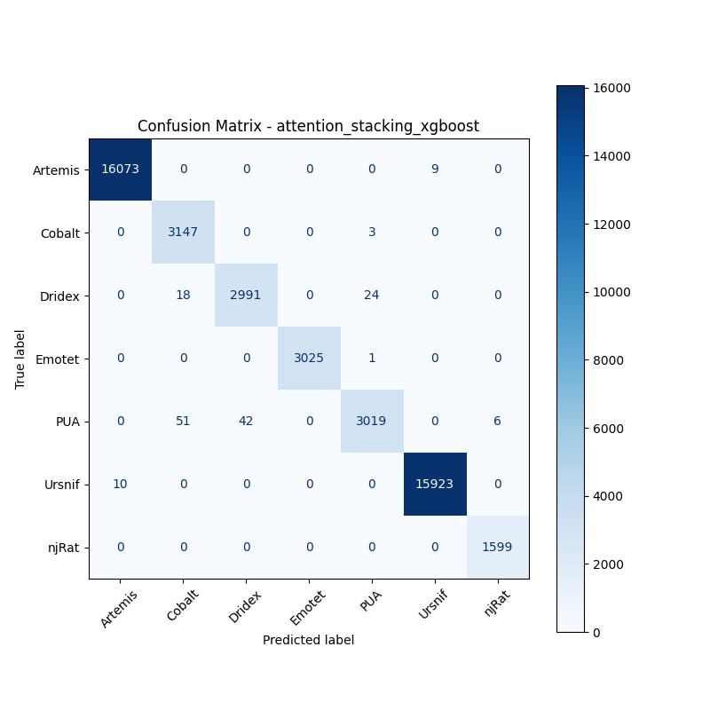
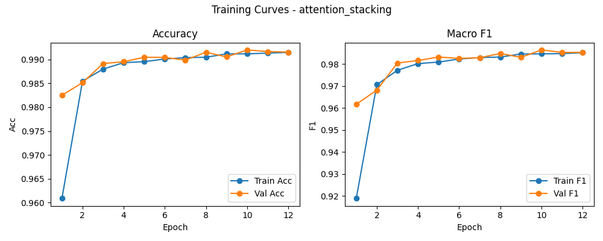

# 融合方式: attention+stacking (xgboost)

**Test Accuracy:** 0.9964

**Macro F1:** 0.9930

**分类报告:**

              precision    recall  f1-score   support

           0     0.9994    0.9994    0.9994     16082
           1     0.9785    0.9990    0.9887      3150
           2     0.9862    0.9862    0.9862      3033
           3     1.0000    0.9997    0.9998      3026
           4     0.9908    0.9682    0.9794      3118
           5     0.9994    0.9994    0.9994     15933
           6     0.9963    1.0000    0.9981      1599

    accuracy                         0.9964     45941
   macro avg     0.9929    0.9931    0.9930     45941
weighted avg     0.9964    0.9964    0.9964     45941

**混淆矩阵:**

[[16073     0     0     0     0     9     0]
 [    0  3147     0     0     3     0     0]
 [    0    18  2991     0    24     0     0]
 [    0     0     0  3025     1     0     0]
 [    0    51    42     0  3019     0     6]
 [   10     0     0     0     0 15923     0]
 [    0     0     0     0     0     0  1599]]

