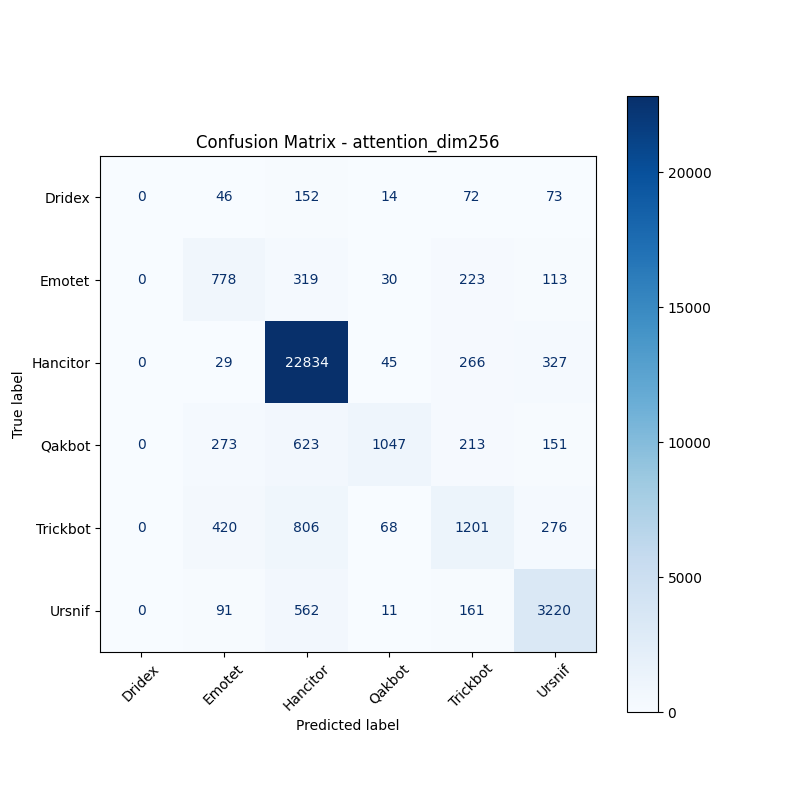
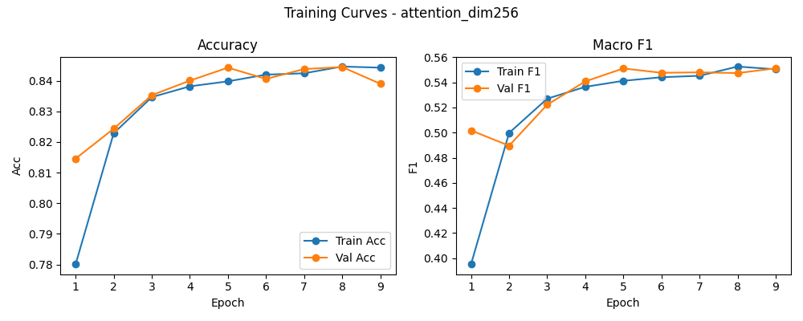

# 融合方式: attention

**Test Accuracy:** 0.8443

**Macro F1:** 0.5511

**分类报告:**

              precision    recall  f1-score   support

           0     0.0000    0.0000    0.0000       357
           1     0.4753    0.5318    0.5019      1463
           2     0.9027    0.9716    0.9359     23501
           3     0.8617    0.4538    0.5945      2307
           4     0.5623    0.4334    0.4895      2771
           5     0.7740    0.7960    0.7849      4045

    accuracy                         0.8443     34444
   macro avg     0.5960    0.5311    0.5511     34444
weighted avg     0.8299    0.8443    0.8312     34444

**混淆矩阵:**

[[    0    46   152    14    72    73]
 [    0   778   319    30   223   113]
 [    0    29 22834    45   266   327]
 [    0   273   623  1047   213   151]
 [    0   420   806    68  1201   276]
 [    0    91   562    11   161  3220]]

