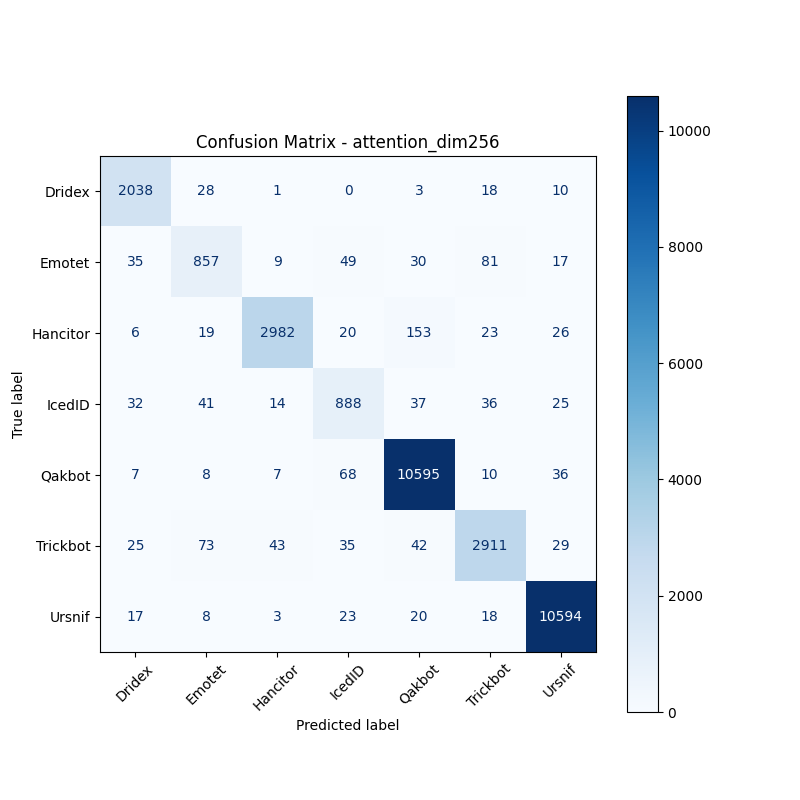
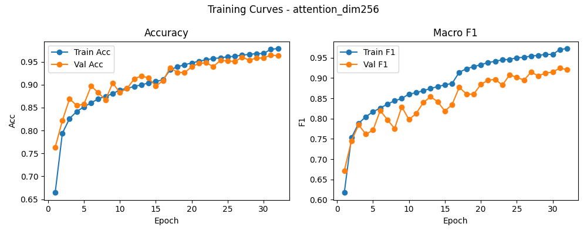

# 融合方式: attention

**Test Accuracy:** 0.9630

**Macro F1:** 0.9202

**分类报告:**

              precision    recall  f1-score   support

           0     0.9435    0.9714    0.9573      2098
           1     0.8288    0.7950    0.8116      1078
           2     0.9748    0.9235    0.9485      3229
           3     0.8199    0.8276    0.8237      1073
           4     0.9738    0.9873    0.9805     10731
           5     0.9399    0.9218    0.9308      3158
           6     0.9867    0.9917    0.9892     10683

    accuracy                         0.9630     32050
   macro avg     0.9239    0.9169    0.9202     32050
weighted avg     0.9629    0.9630    0.9628     32050

**混淆矩阵:**

[[ 2038    28     1     0     3    18    10]
 [   35   857     9    49    30    81    17]
 [    6    19  2982    20   153    23    26]
 [   32    41    14   888    37    36    25]
 [    7     8     7    68 10595    10    36]
 [   25    73    43    35    42  2911    29]
 [   17     8     3    23    20    18 10594]]

