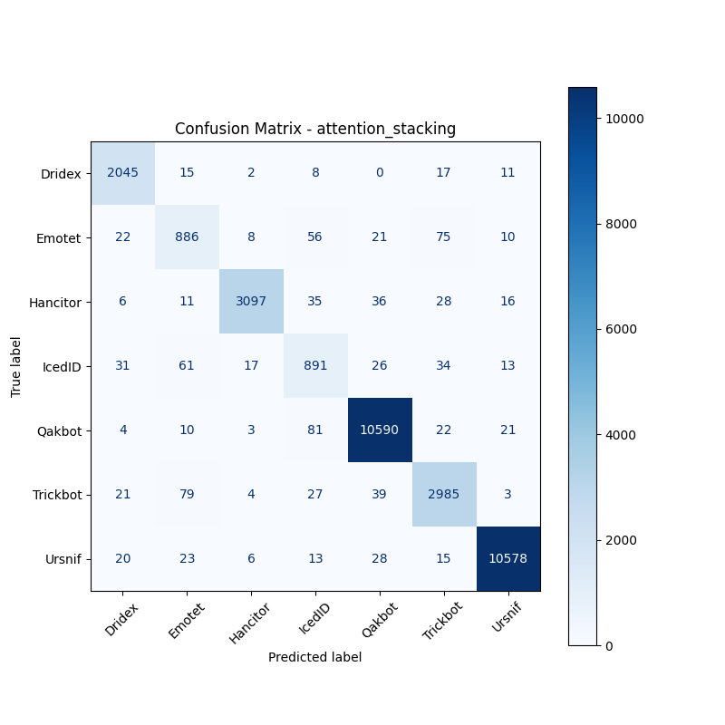

# 融合方式: attention+stacking (attention_stacking)

**Test Accuracy:** 0.9695

**Macro F1:** 0.9274

**分类报告:**

              precision    recall  f1-score   support

           0     0.9516    0.9747    0.9630      2098
           1     0.8166    0.8219    0.8192      1078
           2     0.9872    0.9591    0.9730      3229
           3     0.8020    0.8304    0.8159      1073
           4     0.9860    0.9869    0.9864     10731
           5     0.9399    0.9452    0.9425      3158
           6     0.9931    0.9902    0.9916     10683

    accuracy                         0.9695     32050
   macro avg     0.9252    0.9298    0.9274     32050
weighted avg     0.9698    0.9695    0.9696     32050

**混淆矩阵:**

[[ 2045    15     2     8     0    17    11]
 [   22   886     8    56    21    75    10]
 [    6    11  3097    35    36    28    16]
 [   31    61    17   891    26    34    13]
 [    4    10     3    81 10590    22    21]
 [   21    79     4    27    39  2985     3]
 [   20    23     6    13    28    15 10578]]

