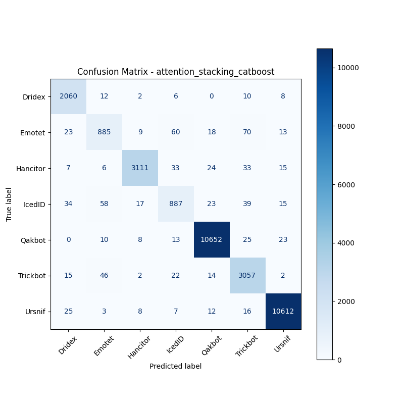

# 融合方式: attention+stacking (catboost)

**Test Accuracy:** 0.9755

**Macro F1:** 0.9383

**分类报告:**

              precision    recall  f1-score   support

           0     0.9519    0.9819    0.9667      2098
           1     0.8676    0.8210    0.8437      1078
           2     0.9854    0.9635    0.9743      3229
           3     0.8628    0.8267    0.8444      1073
           4     0.9915    0.9926    0.9921     10731
           5     0.9406    0.9680    0.9541      3158
           6     0.9929    0.9934    0.9931     10683

    accuracy                         0.9755     32050
   macro avg     0.9418    0.9353    0.9383     32050
weighted avg     0.9753    0.9755    0.9753     32050

**混淆矩阵:**

[[ 2060    12     2     6     0    10     8]
 [   23   885     9    60    18    70    13]
 [    7     6  3111    33    24    33    15]
 [   34    58    17   887    23    39    15]
 [    0    10     8    13 10652    25    23]
 [   15    46     2    22    14  3057     2]
 [   25     3     8     7    12    16 10612]]

