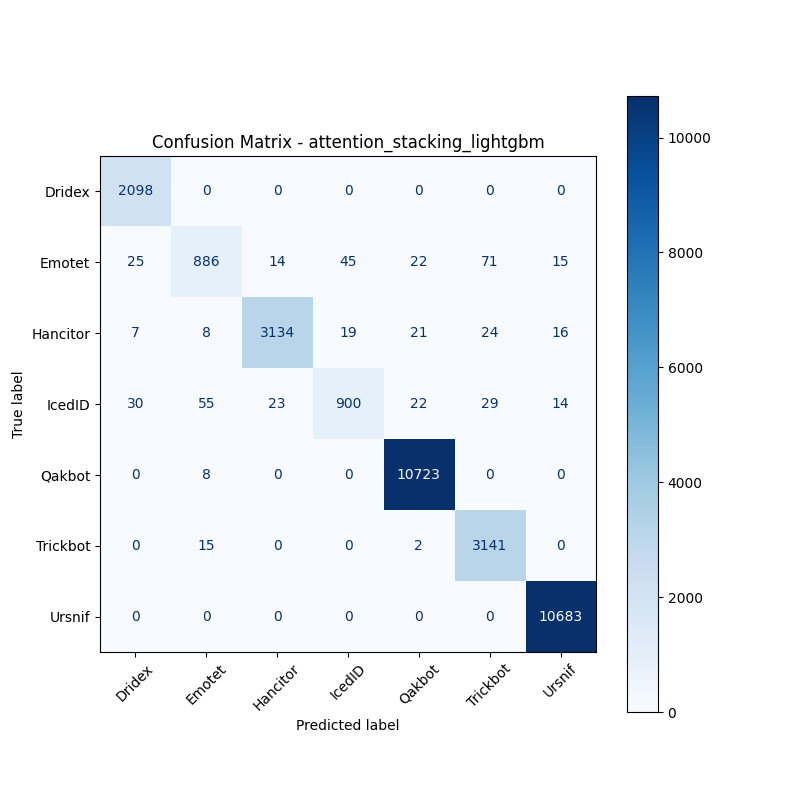

# 融合方式: attention+stacking (lightgbm)

**Test Accuracy:** 0.9849

**Macro F1:** 0.9550

**分类报告:**

              precision    recall  f1-score   support

           0     0.9713    1.0000    0.9854      2098
           1     0.9115    0.8219    0.8644      1078
           2     0.9883    0.9706    0.9794      3229
           3     0.9336    0.8388    0.8837      1073
           4     0.9938    0.9993    0.9965     10731
           5     0.9620    0.9946    0.9780      3158
           6     0.9958    1.0000    0.9979     10683

    accuracy                         0.9849     32050
   macro avg     0.9652    0.9464    0.9550     32050
weighted avg     0.9845    0.9849    0.9845     32050

**混淆矩阵:**

[[ 2098     0     0     0     0     0     0]
 [   25   886    14    45    22    71    15]
 [    7     8  3134    19    21    24    16]
 [   30    55    23   900    22    29    14]
 [    0     8     0     0 10723     0     0]
 [    0    15     0     0     2  3141     0]
 [    0     0     0     0     0     0 10683]]

