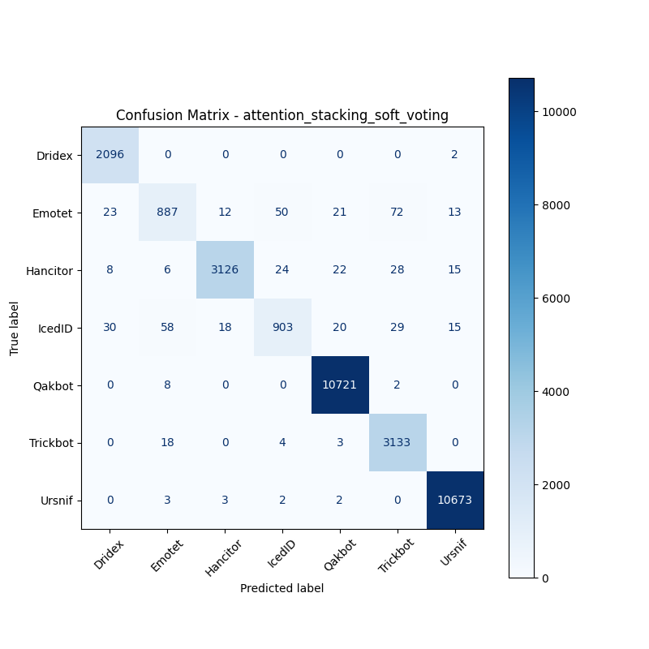

# 融合方式: attention+stacking (soft_voting)

**Test Accuracy:** 0.9841

**Macro F1:** 0.9534

**分类报告:**

              precision    recall  f1-score   support

           0     0.9717    0.9990    0.9852      2098
           1     0.9051    0.8228    0.8620      1078
           2     0.9896    0.9681    0.9787      3229
           3     0.9186    0.8416    0.8784      1073
           4     0.9937    0.9991    0.9964     10731
           5     0.9599    0.9921    0.9757      3158
           6     0.9958    0.9991    0.9974     10683

    accuracy                         0.9841     32050
   macro avg     0.9621    0.9460    0.9534     32050
weighted avg     0.9837    0.9841    0.9837     32050

**混淆矩阵:**

[[ 2096     0     0     0     0     0     2]
 [   23   887    12    50    21    72    13]
 [    8     6  3126    24    22    28    15]
 [   30    58    18   903    20    29    15]
 [    0     8     0     0 10721     2     0]
 [    0    18     0     4     3  3133     0]
 [    0     3     3     2     2     0 10673]]

