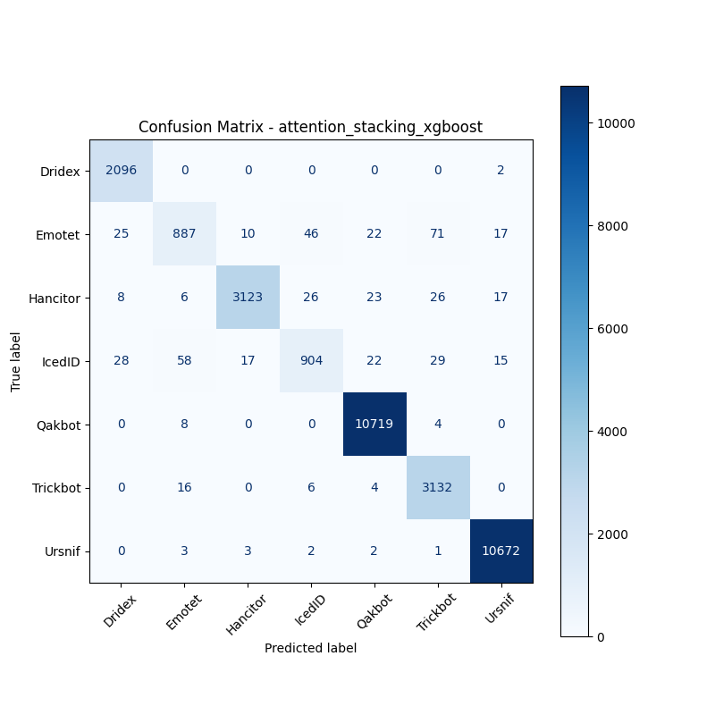
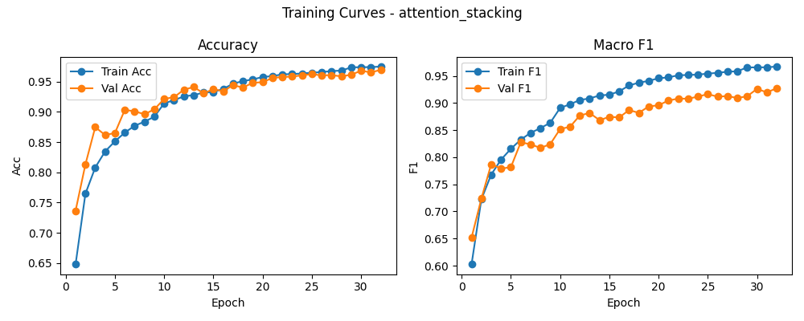

# 融合方式: attention+stacking (xgboost)

**Test Accuracy:** 0.9839

**Macro F1:** 0.9535

**分类报告:**

              precision    recall  f1-score   support

           0     0.9717    0.9990    0.9852      2098
           1     0.9070    0.8228    0.8628      1078
           2     0.9905    0.9672    0.9787      3229
           3     0.9187    0.8425    0.8789      1073
           4     0.9932    0.9989    0.9961     10731
           5     0.9599    0.9918    0.9755      3158
           6     0.9952    0.9990    0.9971     10683

    accuracy                         0.9839     32050
   macro avg     0.9623    0.9459    0.9535     32050
weighted avg     0.9835    0.9839    0.9835     32050

**混淆矩阵:**

[[ 2096     0     0     0     0     0     2]
 [   25   887    10    46    22    71    17]
 [    8     6  3123    26    23    26    17]
 [   28    58    17   904    22    29    15]
 [    0     8     0     0 10719     4     0]
 [    0    16     0     6     4  3132     0]
 [    0     3     3     2     2     1 10672]]

