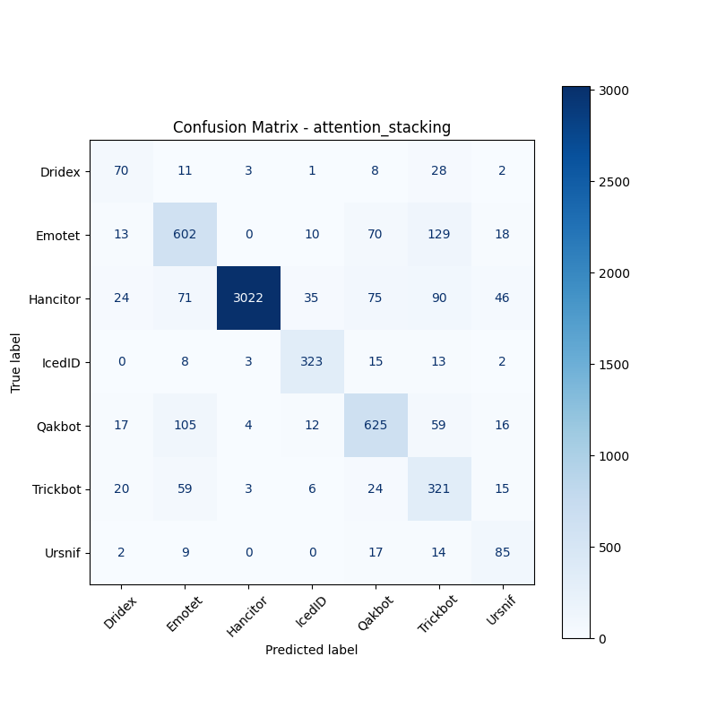

# 融合方式: attention+stacking (attention_stacking)

**Test Accuracy:** 0.8269

**Macro F1:** 0.7011

**分类报告:**

              precision    recall  f1-score   support

           0     0.4795    0.5691    0.5204       123
           1     0.6960    0.7150    0.7053       842
           2     0.9957    0.8986    0.9447      3363
           3     0.8346    0.8874    0.8602       364
           4     0.7494    0.7458    0.7476       838
           5     0.4908    0.7165    0.5826       448
           6     0.4620    0.6693    0.5466       127

    accuracy                         0.8269      6105
   macro avg     0.6726    0.7431    0.7011      6105
weighted avg     0.8524    0.8269    0.8362      6105

**混淆矩阵:**

[[  70   11    3    1    8   28    2]
 [  13  602    0   10   70  129   18]
 [  24   71 3022   35   75   90   46]
 [   0    8    3  323   15   13    2]
 [  17  105    4   12  625   59   16]
 [  20   59    3    6   24  321   15]
 [   2    9    0    0   17   14   85]]

