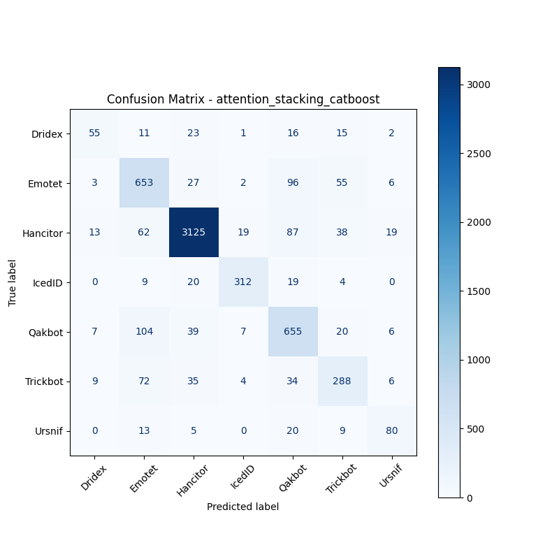

# 融合方式: attention+stacking (catboost)

**Test Accuracy:** 0.8465

**Macro F1:** 0.7335

**分类报告:**

              precision    recall  f1-score   support

           0     0.6322    0.4472    0.5238       123
           1     0.7067    0.7755    0.7395       842
           2     0.9545    0.9292    0.9417      3363
           3     0.9043    0.8571    0.8801       364
           4     0.7066    0.7816    0.7422       838
           5     0.6713    0.6429    0.6568       448
           6     0.6723    0.6299    0.6504       127

    accuracy                         0.8465      6105
   macro avg     0.7497    0.7234    0.7335      6105
weighted avg     0.8502    0.8465    0.8474      6105

**混淆矩阵:**

[[  55   11   23    1   16   15    2]
 [   3  653   27    2   96   55    6]
 [  13   62 3125   19   87   38   19]
 [   0    9   20  312   19    4    0]
 [   7  104   39    7  655   20    6]
 [   9   72   35    4   34  288    6]
 [   0   13    5    0   20    9   80]]

