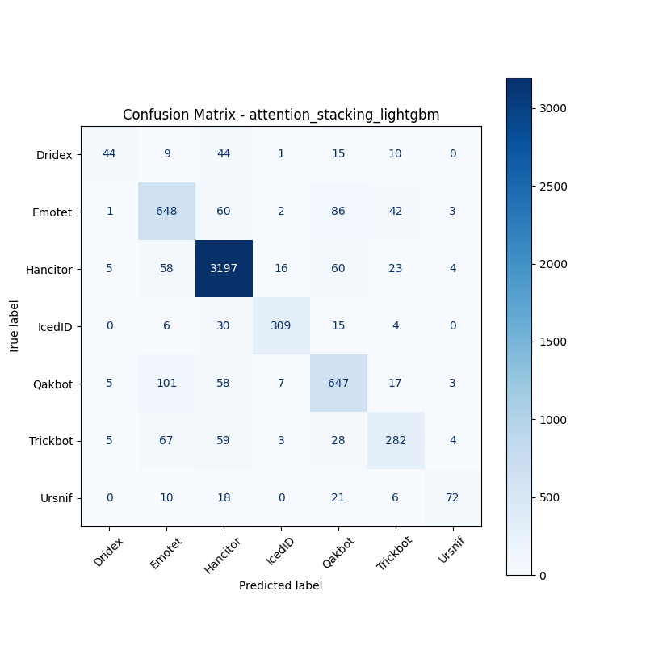

# 融合方式: attention+stacking (lightgbm)

**Test Accuracy:** 0.8516

**Macro F1:** 0.7361

**分类报告:**

              precision    recall  f1-score   support

           0     0.7333    0.3577    0.4809       123
           1     0.7208    0.7696    0.7444       842
           2     0.9224    0.9506    0.9363      3363
           3     0.9142    0.8489    0.8803       364
           4     0.7420    0.7721    0.7567       838
           5     0.7344    0.6295    0.6779       448
           6     0.8372    0.5669    0.6761       127

    accuracy                         0.8516      6105
   macro avg     0.8006    0.6993    0.7361      6105
weighted avg     0.8500    0.8516    0.8483      6105

**混淆矩阵:**

[[  44    9   44    1   15   10    0]
 [   1  648   60    2   86   42    3]
 [   5   58 3197   16   60   23    4]
 [   0    6   30  309   15    4    0]
 [   5  101   58    7  647   17    3]
 [   5   67   59    3   28  282    4]
 [   0   10   18    0   21    6   72]]

