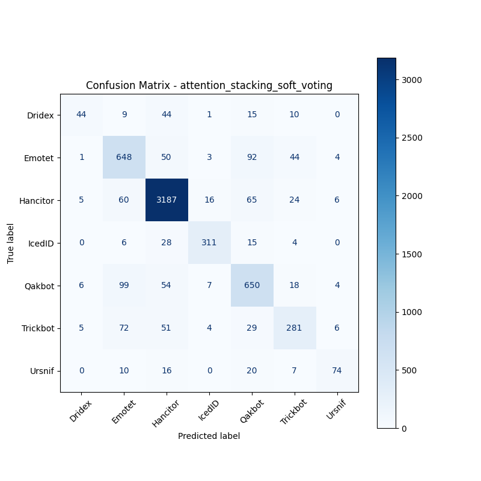

# 融合方式: attention+stacking (soft_voting)

**Test Accuracy:** 0.8509

**Macro F1:** 0.7337

**分类报告:**

              precision    recall  f1-score   support

           0     0.7213    0.3577    0.4783       123
           1     0.7168    0.7696    0.7423       842
           2     0.9292    0.9477    0.9383      3363
           3     0.9094    0.8544    0.8810       364
           4     0.7336    0.7757    0.7541       838
           5     0.7242    0.6272    0.6722       448
           6     0.7872    0.5827    0.6697       127

    accuracy                         0.8509      6105
   macro avg     0.7888    0.7021    0.7337      6105
weighted avg     0.8497    0.8509    0.8482      6105

**混淆矩阵:**

[[  44    9   44    1   15   10    0]
 [   1  648   50    3   92   44    4]
 [   5   60 3187   16   65   24    6]
 [   0    6   28  311   15    4    0]
 [   6   99   54    7  650   18    4]
 [   5   72   51    4   29  281    6]
 [   0   10   16    0   20    7   74]]

