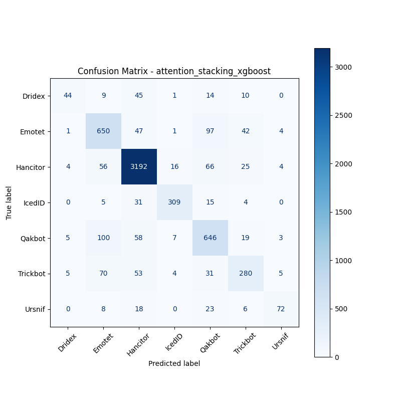
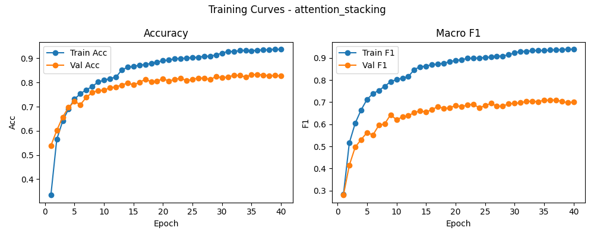

# 融合方式: attention+stacking (xgboost)

**Test Accuracy:** 0.8506

**Macro F1:** 0.7338

**分类报告:**

              precision    recall  f1-score   support

           0     0.7458    0.3577    0.4835       123
           1     0.7238    0.7720    0.7471       842
           2     0.9268    0.9492    0.9379      3363
           3     0.9142    0.8489    0.8803       364
           4     0.7242    0.7709    0.7468       838
           5     0.7254    0.6250    0.6715       448
           6     0.8182    0.5669    0.6698       127

    accuracy                         0.8506      6105
   macro avg     0.7969    0.6987    0.7338      6105
weighted avg     0.8496    0.8506    0.8476      6105

**混淆矩阵:**

[[  44    9   45    1   14   10    0]
 [   1  650   47    1   97   42    4]
 [   4   56 3192   16   66   25    4]
 [   0    5   31  309   15    4    0]
 [   5  100   58    7  646   19    3]
 [   5   70   53    4   31  280    5]
 [   0    8   18    0   23    6   72]]

