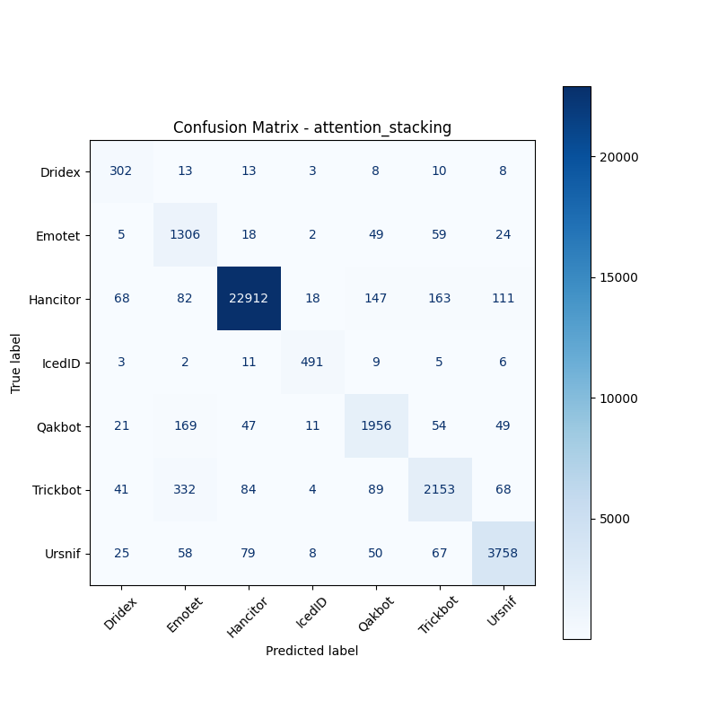

# 融合方式: attention+stacking (attention_stacking)

**Test Accuracy:** 0.9402

**Macro F1:** 0.8567

**分类报告:**

              precision    recall  f1-score   support

           0     0.6495    0.8459    0.7348       357
           1     0.6656    0.8927    0.7626      1463
           2     0.9891    0.9749    0.9820     23501
           3     0.9143    0.9317    0.9229       527
           4     0.8475    0.8479    0.8477      2307
           5     0.8574    0.7770    0.8152      2771
           6     0.9339    0.9290    0.9315      4045

    accuracy                         0.9402     34971
   macro avg     0.8368    0.8856    0.8567     34971
weighted avg     0.9448    0.9402    0.9415     34971

**混淆矩阵:**

[[  302    13    13     3     8    10     8]
 [    5  1306    18     2    49    59    24]
 [   68    82 22912    18   147   163   111]
 [    3     2    11   491     9     5     6]
 [   21   169    47    11  1956    54    49]
 [   41   332    84     4    89  2153    68]
 [   25    58    79     8    50    67  3758]]

